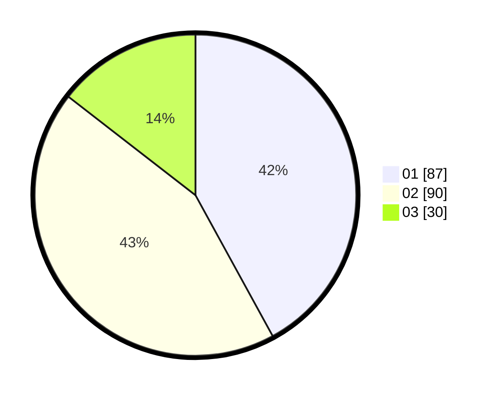

# Hasil

Hasil perolehan suara paslon dapat dilihat pada file paslon-01.txt, paslon-02.txt, dan paslon-03.txt.

Jika tidak ada, artinya data tersebut belum ada pada SIREKAP.

## Perolehan Suara

 * Paslon 01: **87**.
 * Paslon 02: **90**.
 * Paslon 03: **30**.

## Foto C Plano

https://sirekap-obj-formc.kpu.go.id/5cea/pemilu/ppwp/31/74/04/10/05/3174041005138-20240215-015836--dbe25fa7-573d-4d25-ab7a-7f70390115fb.jpg

https://sirekap-obj-formc.kpu.go.id/5cea/pemilu/ppwp/31/74/04/10/05/3174041005138-20240217-105249--187499cd-5a63-407c-980d-19dcd31698e5.jpg

https://sirekap-obj-formc.kpu.go.id/5cea/pemilu/ppwp/31/74/04/10/05/3174041005138-20240215-213748--3d7b2b8c-6237-4875-a1a6-fef3940bb489.jpg

## DATA PEMILIH TETAP

Jumlah pemilih dalam DPT: **264**.
 * L: **128**.
 * P: **136**.

## DATA PENGGUNA HAK PILIH

Jumlah pengguna hak pilih dalam DPT: **207**.
 * L: **97**.
 * P: **110**.

Jumlah pengguna hak pilih dalam DPTb: **3**.
 * L: **1**.
 * P: **2**.

Jumlah pengguna hak pilih dalam DPK: **1**.
 * L: **0**.
 * P: **1**.

Jumlah pengguna hak pilih: **211**.
 * L: **98**.
 * P: **113**.

## JUMLAH SUARA SAH DAN TIDAK SAH

JUMLAH SELURUH SUARA SAH: **207**.

JUMLAH SUARA TIDAK SAH: **5**.

JUMLAH SELURUH SUARA SAH DAN SUARA TIDAK SAH: **212**.
