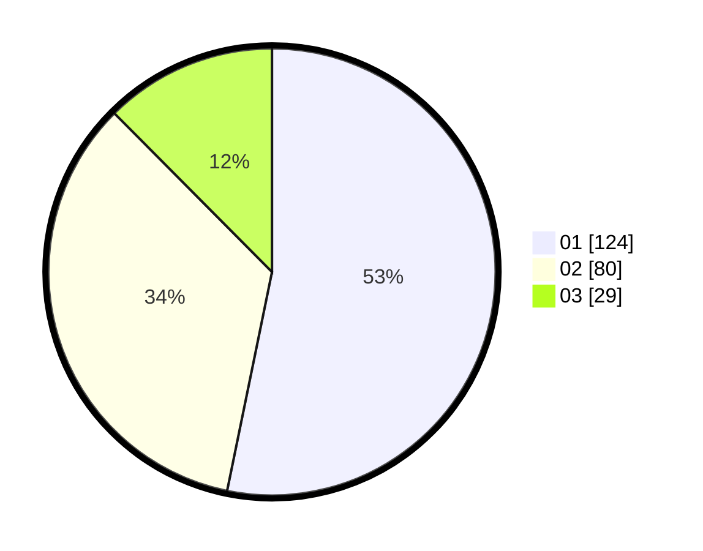

# Hasil

Hasil perolehan suara paslon dapat dilihat pada file paslon-01.txt, paslon-02.txt, dan paslon-03.txt.

Jika tidak ada, artinya data tersebut belum ada pada SIREKAP.

## Perolehan Suara

 * Paslon 01: **124**.
 * Paslon 02: **80**.
 * Paslon 03: **29**.

## Foto C Plano

https://sirekap-obj-formc.kpu.go.id/7896/pemilu/ppwp/31/74/04/10/05/3174041005139-20240214-155606--46ae412e-e084-4277-aac9-7f9f3664e932.jpg

https://sirekap-obj-formc.kpu.go.id/7896/pemilu/ppwp/31/74/04/10/05/3174041005139-20240214-155634--952467bb-a2ab-4623-ae29-4da597b4bfff.jpg

https://sirekap-obj-formc.kpu.go.id/7896/pemilu/ppwp/31/74/04/10/05/3174041005139-20240214-155643--ee2639bd-97d5-411c-9c09-baeba7c58886.jpg

## DATA PEMILIH TETAP

Jumlah pemilih dalam DPT: **275**.
 * L: **137**.
 * P: **138**.

## DATA PENGGUNA HAK PILIH

Jumlah pengguna hak pilih dalam DPT: **238**.
 * L: **119**.
 * P: **119**.

Jumlah pengguna hak pilih dalam DPTb: **0**.
 * L: **0**.
 * P: **0**.

Jumlah pengguna hak pilih dalam DPK: **0**.
 * L: **0**.
 * P: **0**.

Jumlah pengguna hak pilih: **238**.
 * L: **119**.
 * P: **119**.

## JUMLAH SUARA SAH DAN TIDAK SAH

JUMLAH SELURUH SUARA SAH: **233**.

JUMLAH SUARA TIDAK SAH: **6**.

JUMLAH SELURUH SUARA SAH DAN SUARA TIDAK SAH: **239**.
