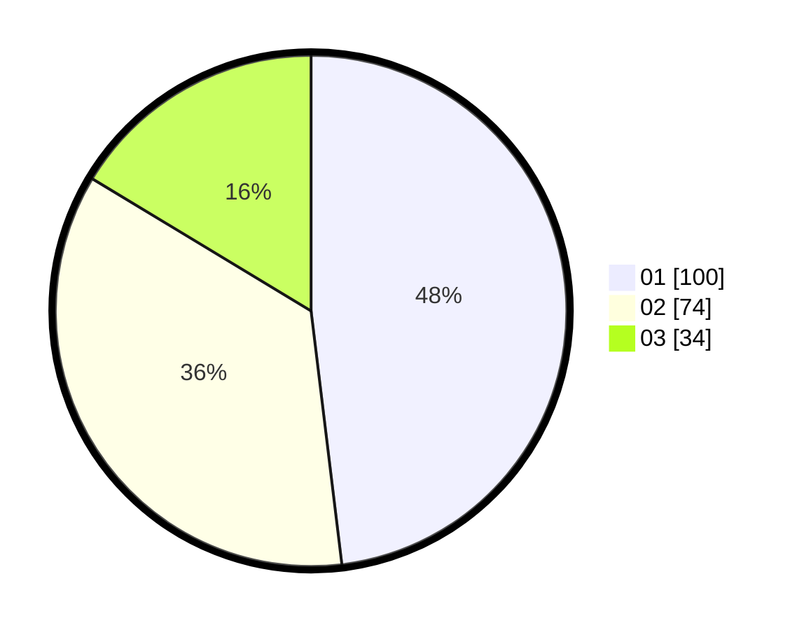

# Hasil

Hasil perolehan suara paslon dapat dilihat pada file paslon-01.txt, paslon-02.txt, dan paslon-03.txt.

Jika tidak ada, artinya data tersebut belum ada pada SIREKAP.

## Perolehan Suara

 * Paslon 01: **100**.
 * Paslon 02: **74**.
 * Paslon 03: **34**.

## Foto C Plano

https://sirekap-obj-formc.kpu.go.id/0713/pemilu/ppwp/31/74/04/10/05/3174041005144-20240214-202833--25ba4cd4-601f-4113-b822-efeae350a861.jpg

https://sirekap-obj-formc.kpu.go.id/0713/pemilu/ppwp/31/74/04/10/05/3174041005144-20240214-203238--cd6ca2ad-94eb-4d26-b669-e154006352c8.jpg

https://sirekap-obj-formc.kpu.go.id/0713/pemilu/ppwp/31/74/04/10/05/3174041005144-20240214-203518--7c4ed65e-6ea1-42a9-84ed-841493b9a7d9.jpg

## DATA PEMILIH TETAP

Jumlah pemilih dalam DPT: **263**.
 * L: **130**.
 * P: **133**.

## DATA PENGGUNA HAK PILIH

Jumlah pengguna hak pilih dalam DPT: **205**.
 * L: **99**.
 * P: **106**.

Jumlah pengguna hak pilih dalam DPTb: **4**.
 * L: **1**.
 * P: **3**.

Jumlah pengguna hak pilih dalam DPK: **2**.
 * L: **1**.
 * P: **1**.

Jumlah pengguna hak pilih: **211**.
 * L: **101**.
 * P: **110**.

## JUMLAH SUARA SAH DAN TIDAK SAH

JUMLAH SELURUH SUARA SAH: **208**.

JUMLAH SUARA TIDAK SAH: **3**.

JUMLAH SELURUH SUARA SAH DAN SUARA TIDAK SAH: **211**.
