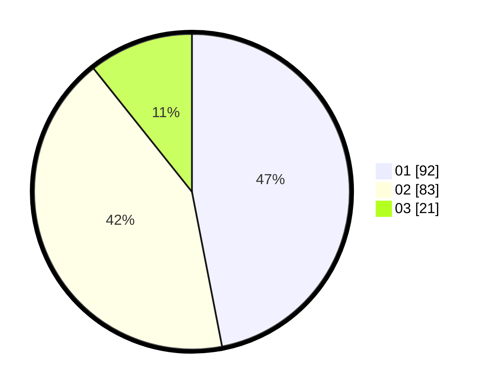

# Hasil

Hasil perolehan suara paslon dapat dilihat pada file paslon-01.txt, paslon-02.txt, dan paslon-03.txt.

Jika tidak ada, artinya data tersebut belum ada pada SIREKAP.

## Perolehan Suara

 * Paslon 01: **92**.
 * Paslon 02: **83**.
 * Paslon 03: **21**.

## Foto C Plano

https://sirekap-obj-formc.kpu.go.id/78ad/pemilu/ppwp/31/74/04/10/05/3174041005145-20240216-211640--72506f65-b5ed-4349-bf28-40b3843c596b.jpg

https://sirekap-obj-formc.kpu.go.id/78ad/pemilu/ppwp/31/74/04/10/05/3174041005145-20240216-200433--c5197e55-65c5-4b7f-b091-ddaf512183b9.jpg

https://sirekap-obj-formc.kpu.go.id/78ad/pemilu/ppwp/31/74/04/10/05/3174041005145-20240216-200726--9fca612d-1e59-4ccb-9fa4-4c762881eff9.jpg

## DATA PEMILIH TETAP

Jumlah pemilih dalam DPT: **268**.
 * L: **133**.
 * P: **135**.

## DATA PENGGUNA HAK PILIH

Jumlah pengguna hak pilih dalam DPT: **197**.
 * L: **101**.
 * P: **96**.

Jumlah pengguna hak pilih dalam DPTb: **6**.
 * L: **3**.
 * P: **3**.

Jumlah pengguna hak pilih dalam DPK: **0**.
 * L: **0**.
 * P: **0**.

Jumlah pengguna hak pilih: **203**.
 * L: **104**.
 * P: **99**.

## JUMLAH SUARA SAH DAN TIDAK SAH

JUMLAH SELURUH SUARA SAH: **196**.

JUMLAH SUARA TIDAK SAH: **7**.

JUMLAH SELURUH SUARA SAH DAN SUARA TIDAK SAH: **203**.
