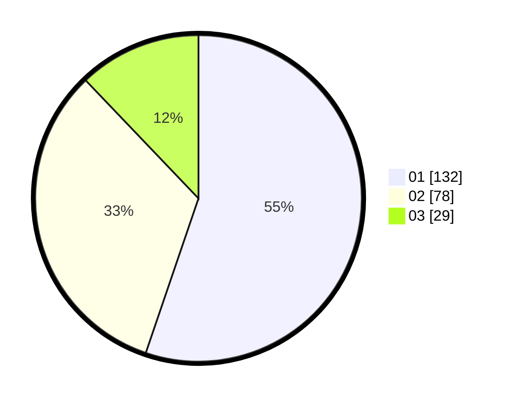

# Hasil

Hasil perolehan suara paslon dapat dilihat pada file paslon-01.txt, paslon-02.txt, dan paslon-03.txt.

Jika tidak ada, artinya data tersebut belum ada pada SIREKAP.

## Perolehan Suara

 * Paslon 01: **132**.
 * Paslon 02: **78**.
 * Paslon 03: **29**.

## Foto C Plano

https://sirekap-obj-formc.kpu.go.id/7dd5/pemilu/ppwp/31/74/04/10/05/3174041005150-20240214-211053--f4fe1f03-d63b-41dc-84ba-6142881a4391.jpg

https://sirekap-obj-formc.kpu.go.id/7dd5/pemilu/ppwp/31/74/04/10/05/3174041005150-20240214-210015--a0220473-16d6-43f0-bd6f-70b7282c88bc.jpg

https://sirekap-obj-formc.kpu.go.id/7dd5/pemilu/ppwp/31/74/04/10/05/3174041005150-20240214-210047--a66f2494-3b5e-48e3-b47a-bbc192561d89.jpg

## DATA PEMILIH TETAP

Jumlah pemilih dalam DPT: **293**.
 * L: **144**.
 * P: **149**.

## DATA PENGGUNA HAK PILIH

Jumlah pengguna hak pilih dalam DPT: **242**.
 * L: **114**.
 * P: **128**.

Jumlah pengguna hak pilih dalam DPTb: **0**.
 * L: **0**.
 * P: **0**.

Jumlah pengguna hak pilih dalam DPK: **0**.
 * L: **0**.
 * P: **0**.

Jumlah pengguna hak pilih: **242**.
 * L: **114**.
 * P: **128**.

## JUMLAH SUARA SAH DAN TIDAK SAH

JUMLAH SELURUH SUARA SAH: **239**.

JUMLAH SUARA TIDAK SAH: **3**.

JUMLAH SELURUH SUARA SAH DAN SUARA TIDAK SAH: **242**.
