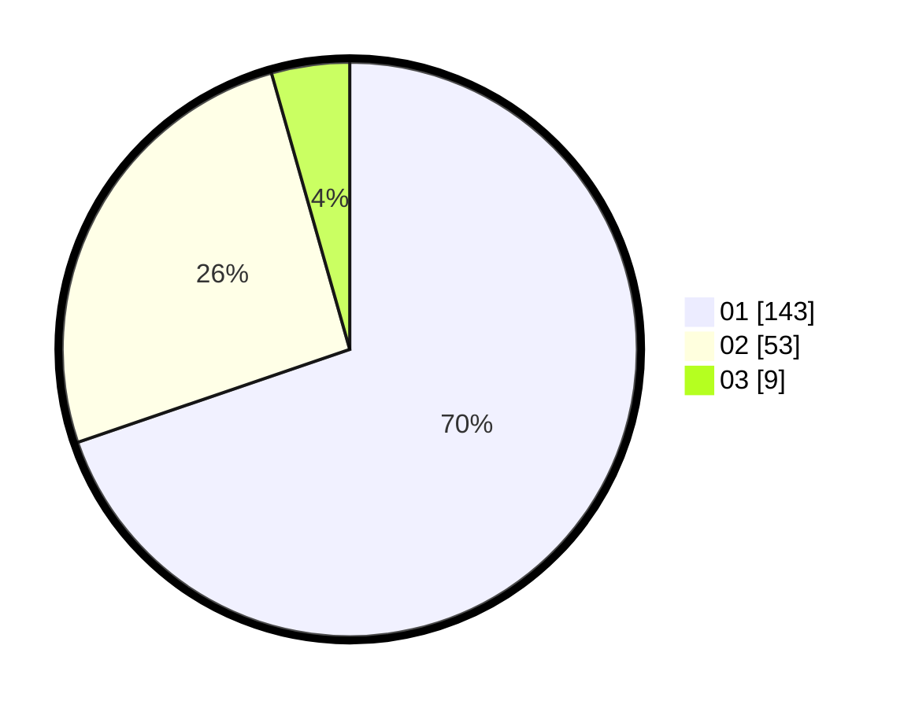

# Hasil

Hasil perolehan suara paslon dapat dilihat pada file paslon-01.txt, paslon-02.txt, dan paslon-03.txt.

Jika tidak ada, artinya data tersebut belum ada pada SIREKAP.

## Perolehan Suara

 * Paslon 01: **143**.
 * Paslon 02: **53**.
 * Paslon 03: **9**.

## Foto C Plano

https://sirekap-obj-formc.kpu.go.id/224f/pemilu/ppwp/31/74/04/10/05/3174041005153-20240214-225622--e8ff8447-55a2-4709-b89c-26b3c6cc1978.jpg

https://sirekap-obj-formc.kpu.go.id/224f/pemilu/ppwp/31/74/04/10/05/3174041005153-20240214-225719--53cd68b1-985c-4c12-bf84-ba77eebd08e5.jpg

https://sirekap-obj-formc.kpu.go.id/224f/pemilu/ppwp/31/74/04/10/05/3174041005153-20240214-225816--29bac03b-59ca-4576-98c6-4a6b82bda969.jpg

## DATA PEMILIH TETAP

Jumlah pemilih dalam DPT: **250**.
 * L: **136**.
 * P: **114**.

## DATA PENGGUNA HAK PILIH

Jumlah pengguna hak pilih dalam DPT: **204**.
 * L: **110**.
 * P: **94**.

Jumlah pengguna hak pilih dalam DPTb: **6**.
 * L: **4**.
 * P: **2**.

Jumlah pengguna hak pilih dalam DPK: **0**.
 * L: **0**.
 * P: **0**.

Jumlah pengguna hak pilih: **210**.
 * L: **114**.
 * P: **96**.

## JUMLAH SUARA SAH DAN TIDAK SAH

JUMLAH SELURUH SUARA SAH: **205**.

JUMLAH SUARA TIDAK SAH: **5**.

JUMLAH SELURUH SUARA SAH DAN SUARA TIDAK SAH: **210**.
