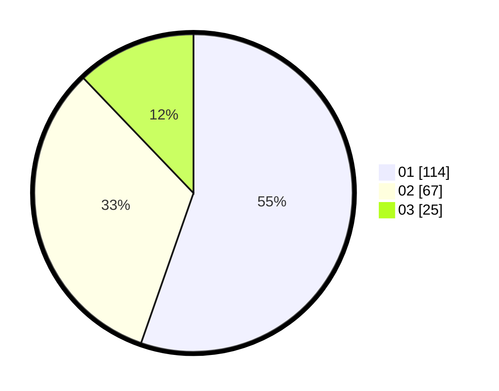

# Hasil

Hasil perolehan suara paslon dapat dilihat pada file paslon-01.txt, paslon-02.txt, dan paslon-03.txt.

Jika tidak ada, artinya data tersebut belum ada pada SIREKAP.

## Perolehan Suara

 * Paslon 01: **114**.
 * Paslon 02: **67**.
 * Paslon 03: **25**.

## Foto C Plano

https://sirekap-obj-formc.kpu.go.id/97a5/pemilu/ppwp/31/74/04/10/05/3174041005160-20240216-144100--c934574e-8ea4-4437-9df1-49021be0aef7.jpg

https://sirekap-obj-formc.kpu.go.id/97a5/pemilu/ppwp/31/74/04/10/05/3174041005160-20240216-144101--235cc480-1a46-4955-a7c5-e4a8ee152651.jpg

https://sirekap-obj-formc.kpu.go.id/97a5/pemilu/ppwp/31/74/04/10/05/3174041005160-20240216-144101--82d42fde-7ca9-4e68-991e-b2475a2dabc7.jpg

## DATA PEMILIH TETAP

Jumlah pemilih dalam DPT: **234**.
 * L: **115**.
 * P: **119**.

## DATA PENGGUNA HAK PILIH

Jumlah pengguna hak pilih dalam DPT: **208**.
 * L: **103**.
 * P: **105**.

Jumlah pengguna hak pilih dalam DPTb: **3**.
 * L: **0**.
 * P: **3**.

Jumlah pengguna hak pilih dalam DPK: **0**.
 * L: **0**.
 * P: **0**.

Jumlah pengguna hak pilih: **211**.
 * L: **103**.
 * P: **108**.

## JUMLAH SUARA SAH DAN TIDAK SAH

JUMLAH SELURUH SUARA SAH: **206**.

JUMLAH SUARA TIDAK SAH: **5**.

JUMLAH SELURUH SUARA SAH DAN SUARA TIDAK SAH: **211**.
