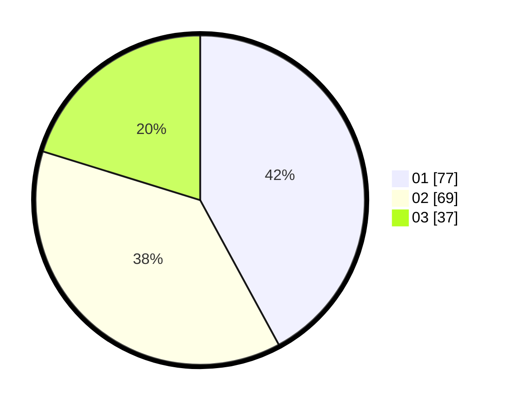

# Hasil

Hasil perolehan suara paslon dapat dilihat pada file paslon-01.txt, paslon-02.txt, dan paslon-03.txt.

Jika tidak ada, artinya data tersebut belum ada pada SIREKAP.

## Perolehan Suara

 * Paslon 01: **77**.
 * Paslon 02: **69**.
 * Paslon 03: **37**.

## Foto C Plano

https://sirekap-obj-formc.kpu.go.id/82c9/pemilu/ppwp/31/74/04/10/05/3174041005171-20240214-213809--d716b085-9d02-424a-bbd4-dd86fcf85172.jpg

https://sirekap-obj-formc.kpu.go.id/82c9/pemilu/ppwp/31/74/04/10/05/3174041005171-20240214-213931--7cca290c-65d2-48c1-baaa-22cd1216ae9e.jpg

https://sirekap-obj-formc.kpu.go.id/82c9/pemilu/ppwp/31/74/04/10/05/3174041005171-20240214-214050--88e066c3-1c11-4f99-a1b9-9dc45ba26a5f.jpg

## DATA PEMILIH TETAP

Jumlah pemilih dalam DPT: **253**.
 * L: **119**.
 * P: **134**.

## DATA PENGGUNA HAK PILIH

Jumlah pengguna hak pilih dalam DPT: **185**.
 * L: **76**.
 * P: **109**.

Jumlah pengguna hak pilih dalam DPTb: **2**.
 * L: **0**.
 * P: **2**.

Jumlah pengguna hak pilih dalam DPK: **1**.
 * L: **1**.
 * P: **0**.

Jumlah pengguna hak pilih: **188**.
 * L: **77**.
 * P: **111**.

## JUMLAH SUARA SAH DAN TIDAK SAH

JUMLAH SELURUH SUARA SAH: **183**.

JUMLAH SUARA TIDAK SAH: **3**.

JUMLAH SELURUH SUARA SAH DAN SUARA TIDAK SAH: **186**.
