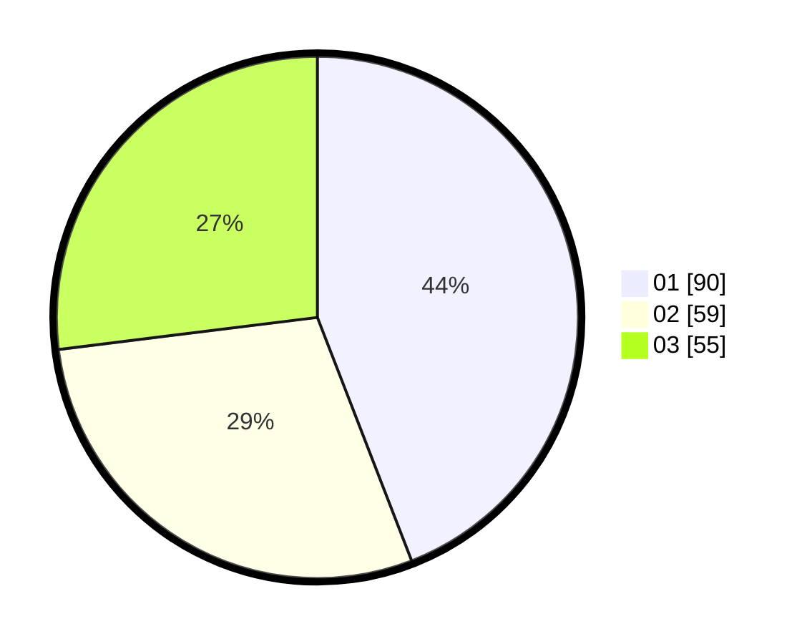

# Hasil

Hasil perolehan suara paslon dapat dilihat pada file paslon-01.txt, paslon-02.txt, dan paslon-03.txt.

Jika tidak ada, artinya data tersebut belum ada pada SIREKAP.

## Perolehan Suara

 * Paslon 01: **90**.
 * Paslon 02: **59**.
 * Paslon 03: **55**.

## Foto C Plano

https://sirekap-obj-formc.kpu.go.id/6f96/pemilu/ppwp/31/74/04/10/05/3174041005172-20240214-155102--c4d8abd4-d1da-499f-9f26-d8d9acf0fd69.jpg

https://sirekap-obj-formc.kpu.go.id/6f96/pemilu/ppwp/31/74/04/10/05/3174041005172-20240214-155121--78d61160-891f-4432-8764-55f9c2101bbe.jpg

https://sirekap-obj-formc.kpu.go.id/6f96/pemilu/ppwp/31/74/04/10/05/3174041005172-20240214-155147--529d74d0-6668-45b9-83bd-07252a0c43cc.jpg

## DATA PEMILIH TETAP

Jumlah pemilih dalam DPT: **210**.
 * L: **103**.
 * P: **107**.

## DATA PENGGUNA HAK PILIH

Jumlah pengguna hak pilih dalam DPT: **205**.
 * L: **101**.
 * P: **104**.

Jumlah pengguna hak pilih dalam DPTb: **3**.
 * L: **2**.
 * P: **1**.

Jumlah pengguna hak pilih dalam DPK: **2**.
 * L: **0**.
 * P: **2**.

Jumlah pengguna hak pilih: **210**.
 * L: **103**.
 * P: **107**.

## JUMLAH SUARA SAH DAN TIDAK SAH

JUMLAH SELURUH SUARA SAH: **204**.

JUMLAH SUARA TIDAK SAH: **6**.

JUMLAH SELURUH SUARA SAH DAN SUARA TIDAK SAH: **210**.
