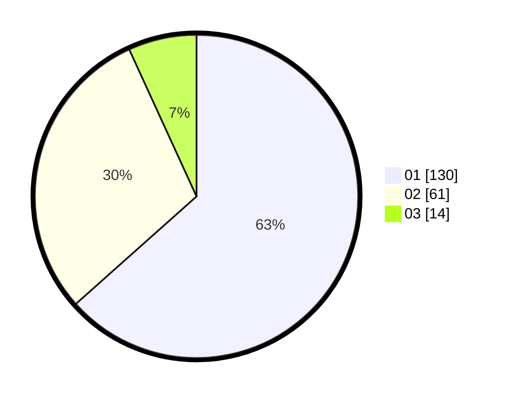

# Hasil

Hasil perolehan suara paslon dapat dilihat pada file paslon-01.txt, paslon-02.txt, dan paslon-03.txt.

Jika tidak ada, artinya data tersebut belum ada pada SIREKAP.

## Perolehan Suara

 * Paslon 01: **130**.
 * Paslon 02: **61**.
 * Paslon 03: **14**.

## Foto C Plano

https://sirekap-obj-formc.kpu.go.id/c382/pemilu/ppwp/31/74/04/10/05/3174041005173-20240214-184738--33c18db2-08ee-4a7e-8002-b66292809eae.jpg

https://sirekap-obj-formc.kpu.go.id/c382/pemilu/ppwp/31/74/04/10/05/3174041005173-20240214-184753--347e8299-7678-49b5-a38c-57f26fb8a85e.jpg

https://sirekap-obj-formc.kpu.go.id/c382/pemilu/ppwp/31/74/04/10/05/3174041005173-20240214-184800--04a84f10-9fdc-4502-89b5-9995540eecd8.jpg

## DATA PEMILIH TETAP

Jumlah pemilih dalam DPT: **264**.
 * L: **131**.
 * P: **133**.

## DATA PENGGUNA HAK PILIH

Jumlah pengguna hak pilih dalam DPT: **206**.
 * L: **101**.
 * P: **105**.

Jumlah pengguna hak pilih dalam DPTb: **1**.
 * L: **1**.
 * P: **0**.

Jumlah pengguna hak pilih dalam DPK: **2**.
 * L: **0**.
 * P: **2**.

Jumlah pengguna hak pilih: **209**.
 * L: **102**.
 * P: **107**.

## JUMLAH SUARA SAH DAN TIDAK SAH

JUMLAH SELURUH SUARA SAH: **205**.

JUMLAH SUARA TIDAK SAH: **4**.

JUMLAH SELURUH SUARA SAH DAN SUARA TIDAK SAH: **209**.
