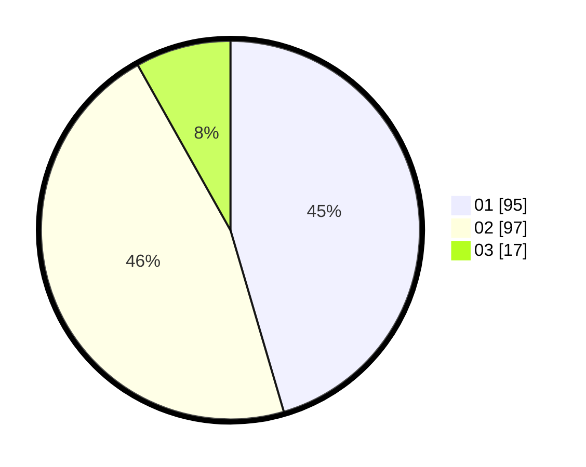

# Hasil

Hasil perolehan suara paslon dapat dilihat pada file paslon-01.txt, paslon-02.txt, dan paslon-03.txt.

Jika tidak ada, artinya data tersebut belum ada pada SIREKAP.

## Perolehan Suara

 * Paslon 01: **95**.
 * Paslon 02: **97**.
 * Paslon 03: **17**.

## Foto C Plano

https://sirekap-obj-formc.kpu.go.id/407c/pemilu/ppwp/31/74/04/10/05/3174041005180-20240215-130853--a12ce625-13d6-4599-9509-928bdf423ba1.jpg

https://sirekap-obj-formc.kpu.go.id/407c/pemilu/ppwp/31/74/04/10/05/3174041005180-20240215-130911--02efa6db-f89a-4c23-9594-f47acabc7b2c.jpg

https://sirekap-obj-formc.kpu.go.id/407c/pemilu/ppwp/31/74/04/10/05/3174041005180-20240215-130915--06ccdbaa-5054-48a3-a220-38fa2f10c424.jpg

## DATA PEMILIH TETAP

Jumlah pemilih dalam DPT: **255**.
 * L: **127**.
 * P: **128**.

## DATA PENGGUNA HAK PILIH

Jumlah pengguna hak pilih dalam DPT: **212**.
 * L: **101**.
 * P: **111**.

Jumlah pengguna hak pilih dalam DPTb: **0**.
 * L: **0**.
 * P: **0**.

Jumlah pengguna hak pilih dalam DPK: **500**.
 * L: **0**.
 * P: **500**.

Jumlah pengguna hak pilih: **213**.
 * L: **102**.
 * P: **111**.

## JUMLAH SUARA SAH DAN TIDAK SAH

JUMLAH SELURUH SUARA SAH: **209**.

JUMLAH SUARA TIDAK SAH: **4**.

JUMLAH SELURUH SUARA SAH DAN SUARA TIDAK SAH: **213**.
