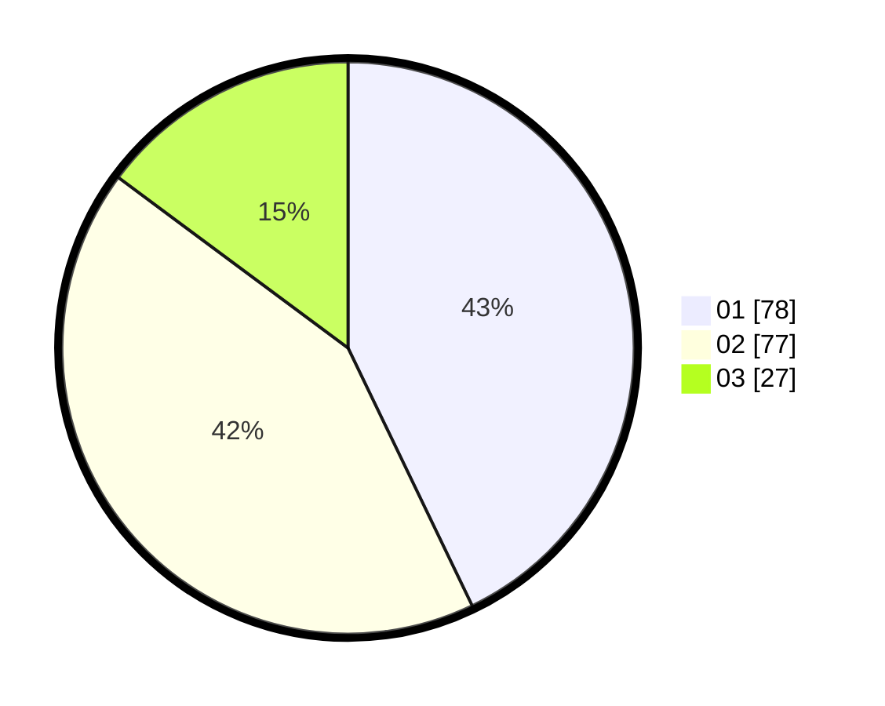

# Hasil

Hasil perolehan suara paslon dapat dilihat pada file paslon-01.txt, paslon-02.txt, dan paslon-03.txt.

Jika tidak ada, artinya data tersebut belum ada pada SIREKAP.

## Perolehan Suara

 * Paslon 01: **78**.
 * Paslon 02: **77**.
 * Paslon 03: **27**.

## Foto C Plano

https://sirekap-obj-formc.kpu.go.id/52fb/pemilu/ppwp/31/74/04/10/05/3174041005183-20240214-213216--9697b72e-f647-4e6e-baa5-974dc1535b3f.jpg

https://sirekap-obj-formc.kpu.go.id/52fb/pemilu/ppwp/31/74/04/10/05/3174041005183-20240214-213224--f1fcae4b-dc18-49db-8613-e6c4ae986474.jpg
