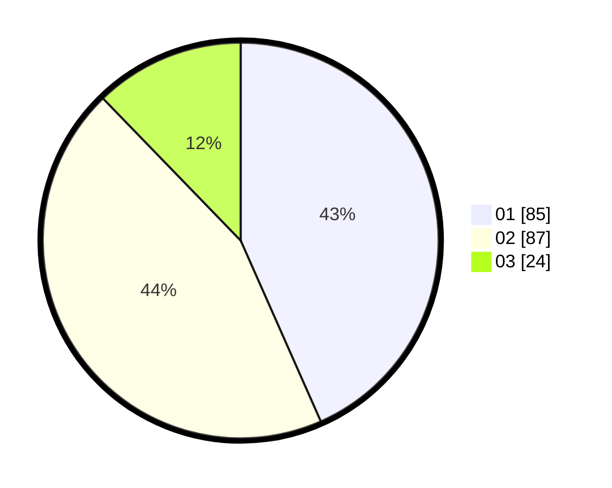

# Hasil

Hasil perolehan suara paslon dapat dilihat pada file paslon-01.txt, paslon-02.txt, dan paslon-03.txt.

Jika tidak ada, artinya data tersebut belum ada pada SIREKAP.

## Perolehan Suara

 * Paslon 01: **85**.
 * Paslon 02: **87**.
 * Paslon 03: **24**.

## Foto C Plano

https://sirekap-obj-formc.kpu.go.id/0643/pemilu/ppwp/31/74/04/10/05/3174041005185-20240214-155038--d9acac1b-d7dd-45c9-a033-99a1ea2a57bc.jpg

https://sirekap-obj-formc.kpu.go.id/0643/pemilu/ppwp/31/74/04/10/05/3174041005185-20240214-155046--ce6ff27b-2060-434f-a7aa-380aa5b84a82.jpg

https://sirekap-obj-formc.kpu.go.id/0643/pemilu/ppwp/31/74/04/10/05/3174041005185-20240214-155053--557b693c-5379-4d46-961a-8c53d6218ef5.jpg

## DATA PEMILIH TETAP

Jumlah pemilih dalam DPT: **261**.
 * L: **129**.
 * P: **132**.

## DATA PENGGUNA HAK PILIH

Jumlah pengguna hak pilih dalam DPT: **198**.
 * L: **90**.
 * P: **108**.

Jumlah pengguna hak pilih dalam DPTb: **1**.
 * L: **1**.
 * P: **0**.

Jumlah pengguna hak pilih dalam DPK: **0**.
 * L: **0**.
 * P: **0**.

Jumlah pengguna hak pilih: **199**.
 * L: **91**.
 * P: **108**.

## JUMLAH SUARA SAH DAN TIDAK SAH

JUMLAH SELURUH SUARA SAH: **196**.

JUMLAH SUARA TIDAK SAH: **3**.

JUMLAH SELURUH SUARA SAH DAN SUARA TIDAK SAH: **199**.
