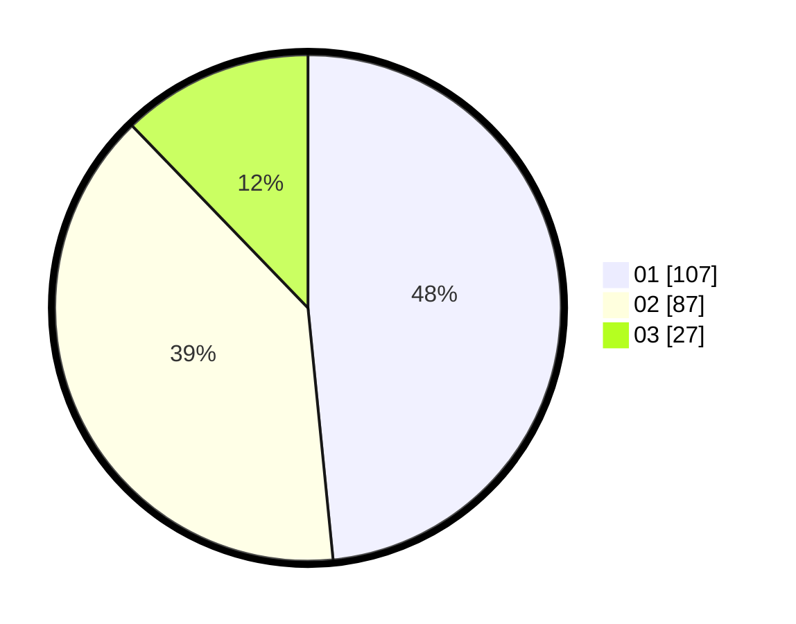

# Hasil

Hasil perolehan suara paslon dapat dilihat pada file paslon-01.txt, paslon-02.txt, dan paslon-03.txt.

Jika tidak ada, artinya data tersebut belum ada pada SIREKAP.

## Perolehan Suara

 * Paslon 01: **107**.
 * Paslon 02: **87**.
 * Paslon 03: **27**.

## Foto C Plano

https://sirekap-obj-formc.kpu.go.id/4cc7/pemilu/ppwp/31/74/04/10/05/3174041005186-20240214-203209--79edb4f1-bfa1-48ca-a71d-819669498146.jpg

https://sirekap-obj-formc.kpu.go.id/4cc7/pemilu/ppwp/31/74/04/10/05/3174041005186-20240214-203536--30b5ca97-6162-49f8-b6dd-496af74f0f31.jpg

https://sirekap-obj-formc.kpu.go.id/4cc7/pemilu/ppwp/31/74/04/10/05/3174041005186-20240215-012426--d9f7a5e5-1881-498b-8390-5b1f54287248.jpg
