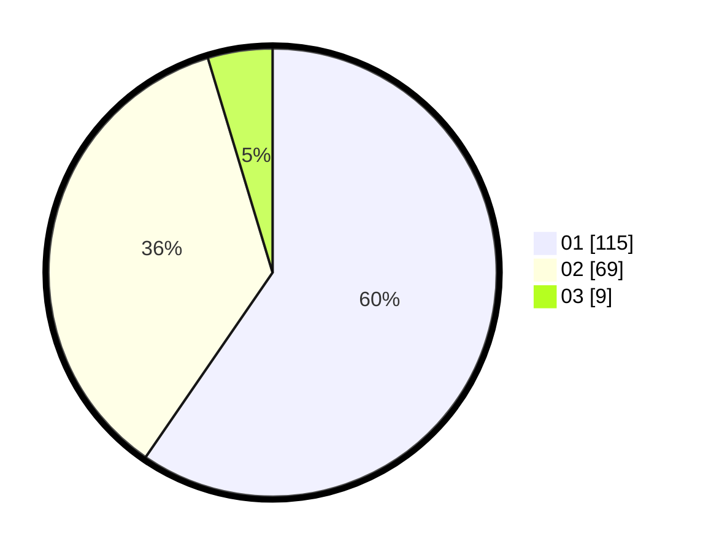

# Hasil

Hasil perolehan suara paslon dapat dilihat pada file paslon-01.txt, paslon-02.txt, dan paslon-03.txt.

Jika tidak ada, artinya data tersebut belum ada pada SIREKAP.

## Perolehan Suara

 * Paslon 01: **115**.
 * Paslon 02: **69**.
 * Paslon 03: **9**.

## Foto C Plano

https://sirekap-obj-formc.kpu.go.id/db70/pemilu/ppwp/31/74/04/10/05/3174041005202-20240214-222630--6576bbdf-30ce-4ab7-bb8c-e51e025e2668.jpg

https://sirekap-obj-formc.kpu.go.id/db70/pemilu/ppwp/31/74/04/10/05/3174041005202-20240214-222637--b047e251-c291-4bc3-9b19-b36ba36d49dc.jpg

https://sirekap-obj-formc.kpu.go.id/db70/pemilu/ppwp/31/74/04/10/05/3174041005202-20240214-222645--f108f501-8931-4b77-9f22-9ca562c4b758.jpg
