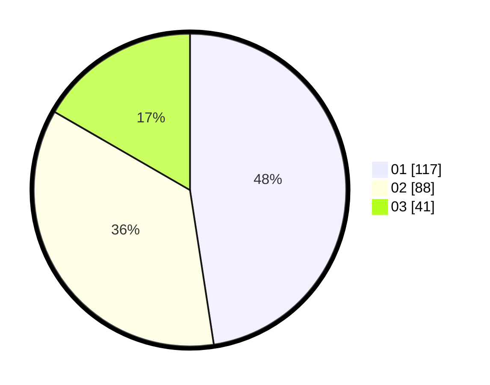

# Hasil

Hasil perolehan suara paslon dapat dilihat pada file paslon-01.txt, paslon-02.txt, dan paslon-03.txt.

Jika tidak ada, artinya data tersebut belum ada pada SIREKAP.

## Perolehan Suara

 * Paslon 01: **117**.
 * Paslon 02: **88**.
 * Paslon 03: **41**.

## Foto C Plano

https://sirekap-obj-formc.kpu.go.id/0eda/pemilu/ppwp/31/74/04/10/06/3174041006001-20240214-185853--41b53882-d2a6-4bf5-8398-f98400b96d81.jpg

https://sirekap-obj-formc.kpu.go.id/0eda/pemilu/ppwp/31/74/04/10/06/3174041006001-20240214-191909--ffffa768-2025-421f-a91b-07c257baad4f.jpg

https://sirekap-obj-formc.kpu.go.id/0eda/pemilu/ppwp/31/74/04/10/06/3174041006001-20240214-185925--422611a2-c9d5-402f-acd0-ca6a841c4ab3.jpg

## DATA PEMILIH TETAP

Jumlah pemilih dalam DPT: **279**.
 * L: **141**.
 * P: **138**.

## DATA PENGGUNA HAK PILIH

Jumlah pengguna hak pilih dalam DPT: **230**.
 * L: **109**.
 * P: **121**.

Jumlah pengguna hak pilih dalam DPTb: **12**.
 * L: **2**.
 * P: **10**.

Jumlah pengguna hak pilih dalam DPK: **7**.
 * L: **3**.
 * P: **4**.

Jumlah pengguna hak pilih: **249**.
 * L: **114**.
 * P: **135**.

## JUMLAH SUARA SAH DAN TIDAK SAH

JUMLAH SELURUH SUARA SAH: **246**.

JUMLAH SUARA TIDAK SAH: **3**.

JUMLAH SELURUH SUARA SAH DAN SUARA TIDAK SAH: **249**.
