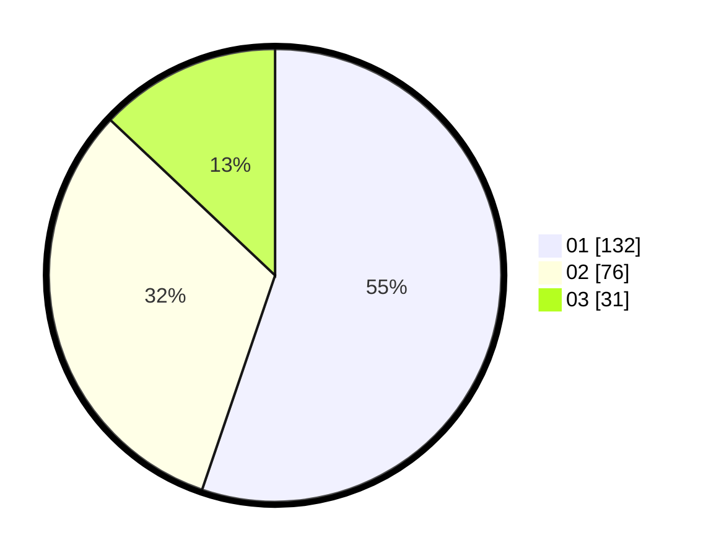

# Hasil

Hasil perolehan suara paslon dapat dilihat pada file paslon-01.txt, paslon-02.txt, dan paslon-03.txt.

Jika tidak ada, artinya data tersebut belum ada pada SIREKAP.

## Perolehan Suara

 * Paslon 01: **132**.
 * Paslon 02: **76**.
 * Paslon 03: **31**.

## Foto C Plano

https://sirekap-obj-formc.kpu.go.id/32f6/pemilu/ppwp/31/74/04/10/06/3174041006005-20240216-140145--993b17d5-f0b6-435a-928f-81a170287706.jpg

https://sirekap-obj-formc.kpu.go.id/32f6/pemilu/ppwp/31/74/04/10/06/3174041006005-20240216-140146--234ea26a-f1d6-46f2-802f-9d18b3e67576.jpg

https://sirekap-obj-formc.kpu.go.id/32f6/pemilu/ppwp/31/74/04/10/06/3174041006005-20240216-140146--aec477b5-6526-45eb-9577-2d8c0e8778bd.jpg

## DATA PEMILIH TETAP

Jumlah pemilih dalam DPT: **284**.
 * L: **150**.
 * P: **134**.

## DATA PENGGUNA HAK PILIH

Jumlah pengguna hak pilih dalam DPT: **225**.
 * L: **115**.
 * P: **110**.

Jumlah pengguna hak pilih dalam DPTb: **12**.
 * L: **5**.
 * P: **7**.

Jumlah pengguna hak pilih dalam DPK: **3**.
 * L: **1**.
 * P: **2**.

Jumlah pengguna hak pilih: **240**.
 * L: **121**.
 * P: **119**.

## JUMLAH SUARA SAH DAN TIDAK SAH

JUMLAH SELURUH SUARA SAH: **239**.

JUMLAH SUARA TIDAK SAH: **1**.

JUMLAH SELURUH SUARA SAH DAN SUARA TIDAK SAH: **240**.
