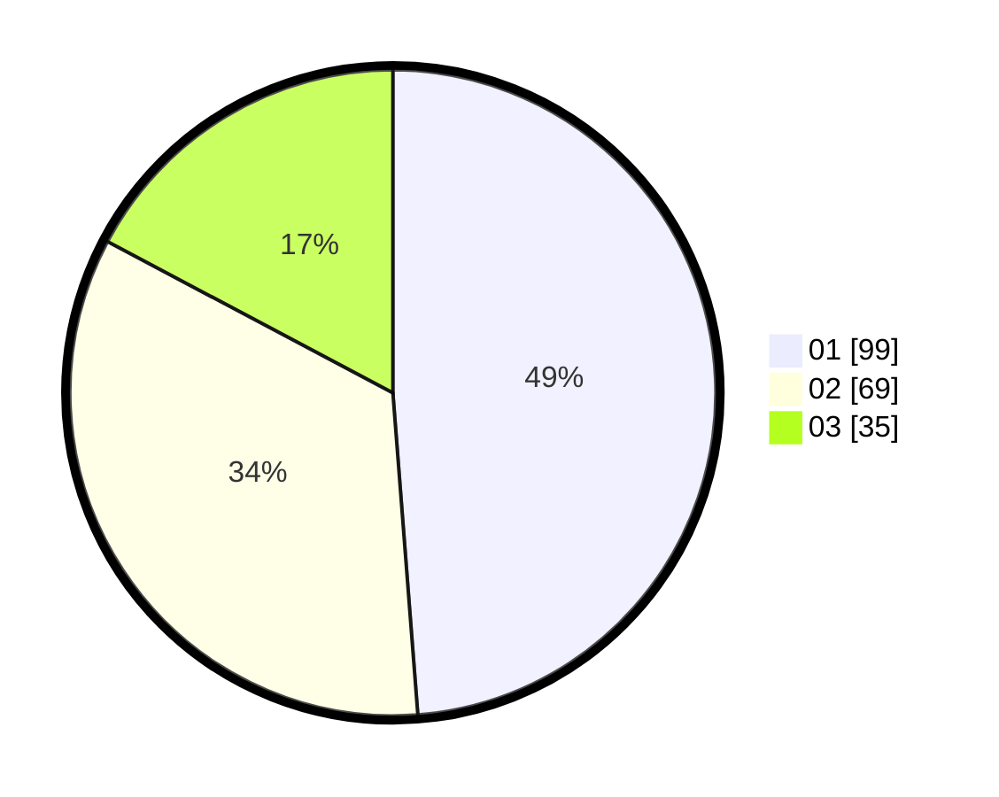

# Hasil

Hasil perolehan suara paslon dapat dilihat pada file paslon-01.txt, paslon-02.txt, dan paslon-03.txt.

Jika tidak ada, artinya data tersebut belum ada pada SIREKAP.

## Perolehan Suara

 * Paslon 01: **99**.
 * Paslon 02: **69**.
 * Paslon 03: **35**.

## Foto C Plano

https://sirekap-obj-formc.kpu.go.id/8661/pemilu/ppwp/31/74/04/10/06/3174041006011-20240217-074923--39f76241-3294-4d42-8b99-4eb45ea4a621.jpg

https://sirekap-obj-formc.kpu.go.id/8661/pemilu/ppwp/31/74/04/10/06/3174041006011-20240217-074805--4d130058-6c0b-4fff-a5e7-017cea146bc5.jpg

https://sirekap-obj-formc.kpu.go.id/8661/pemilu/ppwp/31/74/04/10/06/3174041006011-20240217-080803--fa60c621-df27-4d68-a522-f0c0923b69e6.jpg

## DATA PEMILIH TETAP

Jumlah pemilih dalam DPT: **249**.
 * L: **125**.
 * P: **124**.

## DATA PENGGUNA HAK PILIH

Jumlah pengguna hak pilih dalam DPT: **192**.
 * L: **92**.
 * P: **100**.

Jumlah pengguna hak pilih dalam DPTb: **11**.
 * L: **5**.
 * P: **6**.

Jumlah pengguna hak pilih dalam DPK: **0**.
 * L: **0**.
 * P: **0**.

Jumlah pengguna hak pilih: **203**.
 * L: **97**.
 * P: **106**.

## JUMLAH SUARA SAH DAN TIDAK SAH

JUMLAH SELURUH SUARA SAH: **203**.

JUMLAH SUARA TIDAK SAH: **1**.

JUMLAH SELURUH SUARA SAH DAN SUARA TIDAK SAH: **204**.
