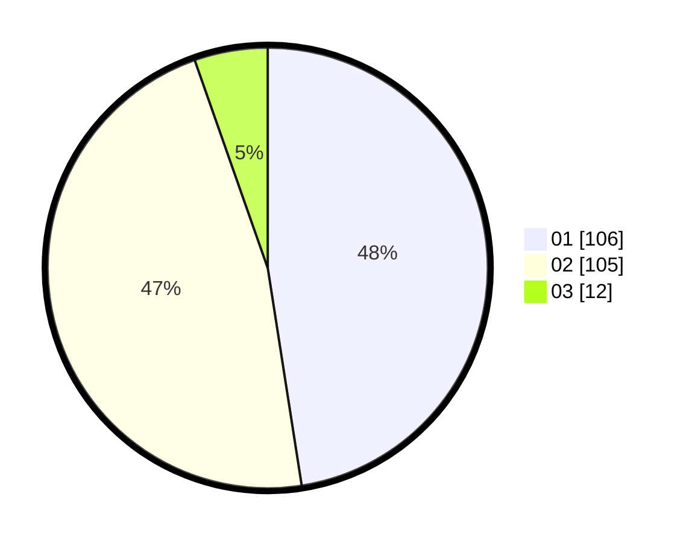

# Hasil

Hasil perolehan suara paslon dapat dilihat pada file paslon-01.txt, paslon-02.txt, dan paslon-03.txt.

Jika tidak ada, artinya data tersebut belum ada pada SIREKAP.

## Perolehan Suara

 * Paslon 01: **106**.
 * Paslon 02: **105**.
 * Paslon 03: **12**.

## Foto C Plano

https://sirekap-obj-formc.kpu.go.id/794b/pemilu/ppwp/31/74/04/10/06/3174041006017-20240216-224712--967300a5-d929-4736-8790-7837ee9ac5ea.jpg

https://sirekap-obj-formc.kpu.go.id/794b/pemilu/ppwp/31/74/04/10/06/3174041006017-20240216-224805--863e154e-acd8-4525-82e7-b1811b4b8341.jpg

https://sirekap-obj-formc.kpu.go.id/794b/pemilu/ppwp/31/74/04/10/06/3174041006017-20240216-231140--553bb307-64b8-4704-8405-837e07cd9f96.jpg
