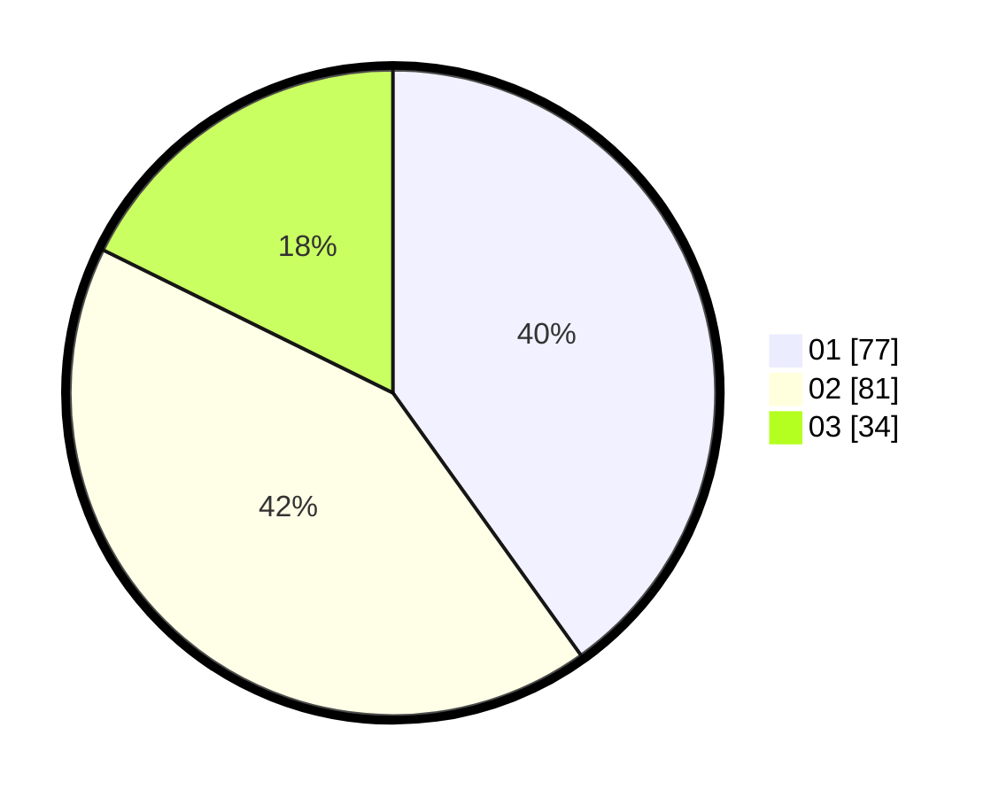

# Hasil

Hasil perolehan suara paslon dapat dilihat pada file paslon-01.txt, paslon-02.txt, dan paslon-03.txt.

Jika tidak ada, artinya data tersebut belum ada pada SIREKAP.

## Perolehan Suara

 * Paslon 01: **77**.
 * Paslon 02: **81**.
 * Paslon 03: **34**.

## Foto C Plano

https://sirekap-obj-formc.kpu.go.id/3f68/pemilu/ppwp/31/74/04/10/06/3174041006024-20240215-015207--0f39ced7-b6ad-444f-9dc0-11857c6484d8.jpg

https://sirekap-obj-formc.kpu.go.id/3f68/pemilu/ppwp/31/74/04/10/06/3174041006024-20240214-193307--b700230e-4f16-40fe-a9bd-f7213fcb75ad.jpg

https://sirekap-obj-formc.kpu.go.id/3f68/pemilu/ppwp/31/74/04/10/06/3174041006024-20240214-221926--9a6c1ef9-b2b5-4cfd-8bad-8e44c9709075.jpg
