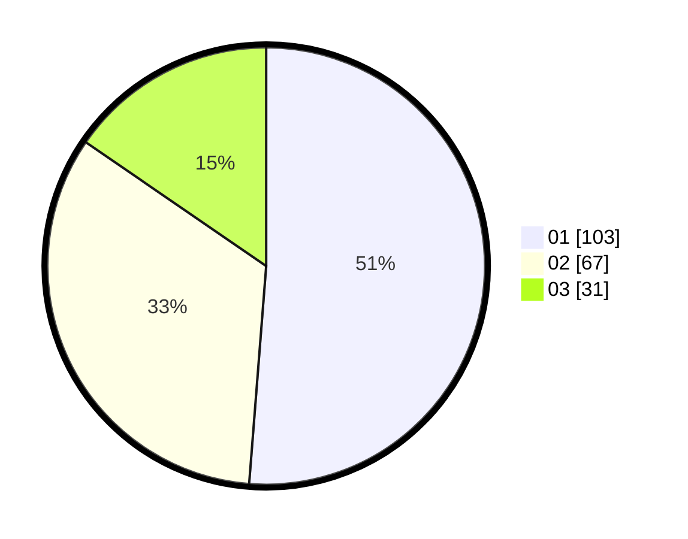

# Hasil

Hasil perolehan suara paslon dapat dilihat pada file paslon-01.txt, paslon-02.txt, dan paslon-03.txt.

Jika tidak ada, artinya data tersebut belum ada pada SIREKAP.

## Perolehan Suara

 * Paslon 01: **103**.
 * Paslon 02: **67**.
 * Paslon 03: **31**.

## Foto C Plano

https://sirekap-obj-formc.kpu.go.id/81b5/pemilu/ppwp/31/74/04/10/06/3174041006030-20240216-183804--9e95d5ea-d09d-4ff1-902b-86375157ad50.jpg

https://sirekap-obj-formc.kpu.go.id/81b5/pemilu/ppwp/31/74/04/10/06/3174041006030-20240214-191544--59cff47f-a555-4979-a7dc-eddc5c0dfe01.jpg

https://sirekap-obj-formc.kpu.go.id/81b5/pemilu/ppwp/31/74/04/10/06/3174041006030-20240214-191552--c540762d-e955-48df-bdf1-388837048b6e.jpg

## DATA PEMILIH TETAP

Jumlah pemilih dalam DPT: **266**.
 * L: **131**.
 * P: **135**.

## DATA PENGGUNA HAK PILIH

Jumlah pengguna hak pilih dalam DPT: **203**.
 * L: **93**.
 * P: **110**.

Jumlah pengguna hak pilih dalam DPTb: **1**.
 * L: **1**.
 * P: **0**.

Jumlah pengguna hak pilih dalam DPK: **3**.
 * L: **1**.
 * P: **2**.

Jumlah pengguna hak pilih: **207**.
 * L: **95**.
 * P: **112**.

## JUMLAH SUARA SAH DAN TIDAK SAH

JUMLAH SELURUH SUARA SAH: **201**.

JUMLAH SUARA TIDAK SAH: **6**.

JUMLAH SELURUH SUARA SAH DAN SUARA TIDAK SAH: **207**.
