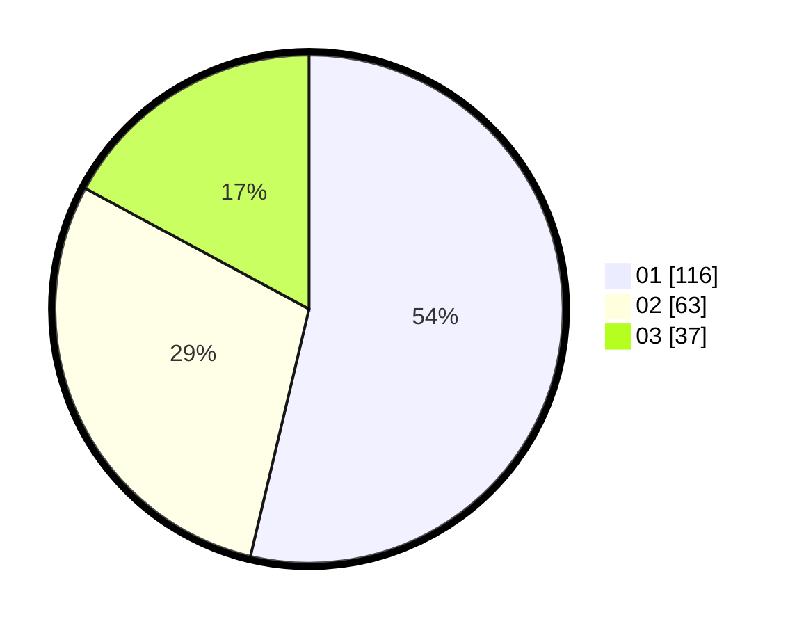

# Hasil

Hasil perolehan suara paslon dapat dilihat pada file paslon-01.txt, paslon-02.txt, dan paslon-03.txt.

Jika tidak ada, artinya data tersebut belum ada pada SIREKAP.

## Perolehan Suara

 * Paslon 01: **116**.
 * Paslon 02: **63**.
 * Paslon 03: **37**.

## Foto C Plano

https://sirekap-obj-formc.kpu.go.id/99d4/pemilu/ppwp/31/74/04/10/06/3174041006038-20240214-162233--49aeb840-7328-409c-8bd1-dcdc7f8e39a6.jpg

https://sirekap-obj-formc.kpu.go.id/99d4/pemilu/ppwp/31/74/04/10/06/3174041006038-20240214-162225--c300981f-1779-4f9c-8afa-3913ebdd49df.jpg

https://sirekap-obj-formc.kpu.go.id/99d4/pemilu/ppwp/31/74/04/10/06/3174041006038-20240214-175305--ee5fbda6-04c5-417d-bb53-e6d87577b2b7.jpg

## DATA PEMILIH TETAP

Jumlah pemilih dalam DPT: **268**.
 * L: **137**.
 * P: **131**.

## DATA PENGGUNA HAK PILIH

Jumlah pengguna hak pilih dalam DPT: **209**.
 * L: **101**.
 * P: **108**.

Jumlah pengguna hak pilih dalam DPTb: **4**.
 * L: **2**.
 * P: **2**.

Jumlah pengguna hak pilih dalam DPK: **6**.
 * L: **3**.
 * P: **3**.

Jumlah pengguna hak pilih: **219**.
 * L: **106**.
 * P: **113**.

## JUMLAH SUARA SAH DAN TIDAK SAH

JUMLAH SELURUH SUARA SAH: **216**.

JUMLAH SUARA TIDAK SAH: **3**.

JUMLAH SELURUH SUARA SAH DAN SUARA TIDAK SAH: **219**.
