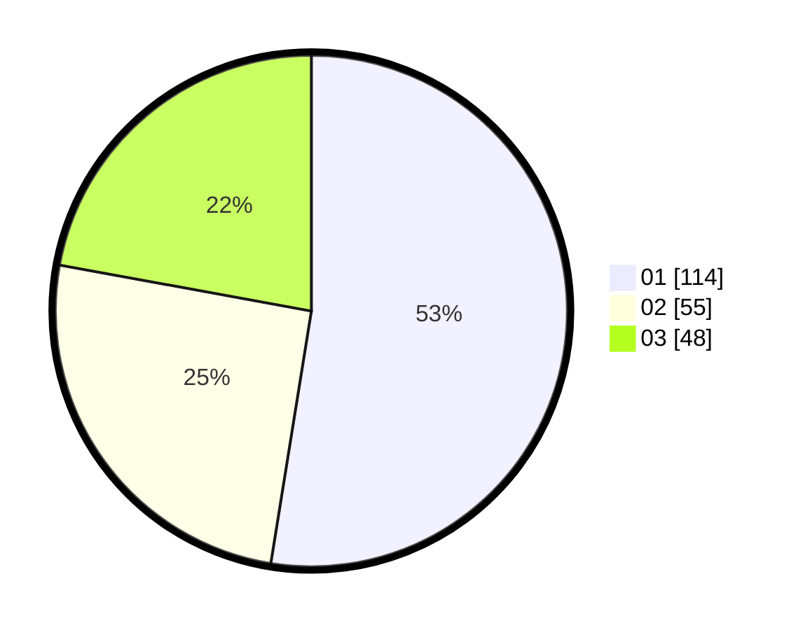

# Hasil

Hasil perolehan suara paslon dapat dilihat pada file paslon-01.txt, paslon-02.txt, dan paslon-03.txt.

Jika tidak ada, artinya data tersebut belum ada pada SIREKAP.

## Perolehan Suara

 * Paslon 01: **114**.
 * Paslon 02: **55**.
 * Paslon 03: **48**.

## Foto C Plano

https://sirekap-obj-formc.kpu.go.id/8ba9/pemilu/ppwp/31/74/04/10/06/3174041006039-20240216-164352--81d15d8f-cbdc-4216-8108-4dc736bf28f6.jpg

https://sirekap-obj-formc.kpu.go.id/8ba9/pemilu/ppwp/31/74/04/10/06/3174041006039-20240216-170952--8b58fecd-9898-4ad7-b214-e8434511dc8a.jpg

https://sirekap-obj-formc.kpu.go.id/8ba9/pemilu/ppwp/31/74/04/10/06/3174041006039-20240217-140635--0bce27c5-22ea-410c-b46c-290612651c8b.jpg

## DATA PEMILIH TETAP

Jumlah pemilih dalam DPT: **268**.
 * L: **137**.
 * P: **131**.

## DATA PENGGUNA HAK PILIH

Jumlah pengguna hak pilih dalam DPT: **211**.
 * L: **105**.
 * P: **106**.

Jumlah pengguna hak pilih dalam DPTb: **7**.
 * L: **2**.
 * P: **5**.

Jumlah pengguna hak pilih dalam DPK: **2**.
 * L: **1**.
 * P: **1**.

Jumlah pengguna hak pilih: **220**.
 * L: **108**.
 * P: **112**.

## JUMLAH SUARA SAH DAN TIDAK SAH

JUMLAH SELURUH SUARA SAH: **217**.

JUMLAH SUARA TIDAK SAH: **3**.

JUMLAH SELURUH SUARA SAH DAN SUARA TIDAK SAH: **220**.
