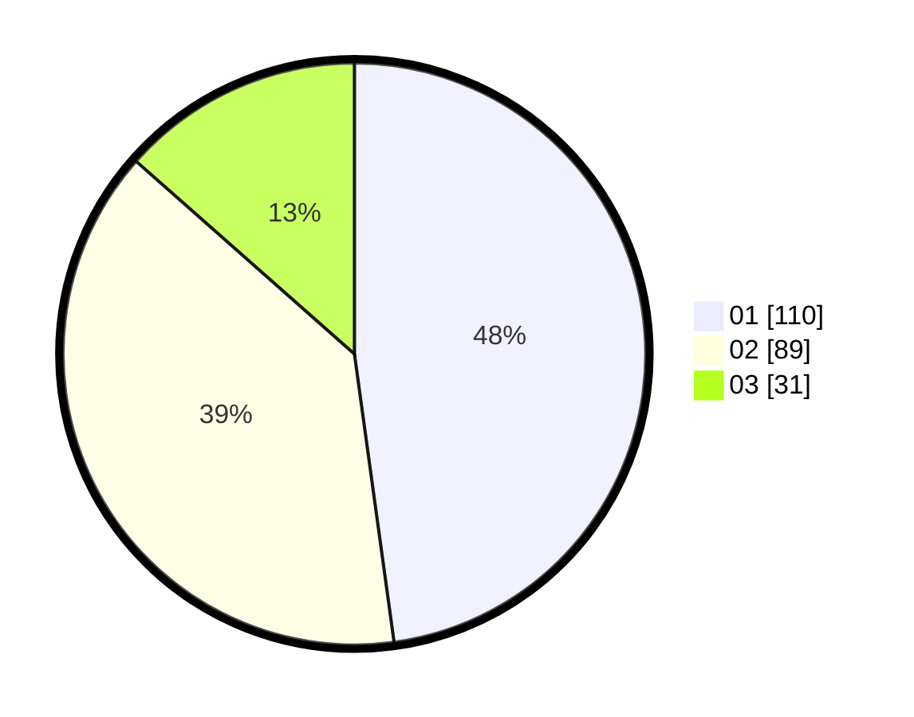

# Hasil

Hasil perolehan suara paslon dapat dilihat pada file paslon-01.txt, paslon-02.txt, dan paslon-03.txt.

Jika tidak ada, artinya data tersebut belum ada pada SIREKAP.

## Perolehan Suara

 * Paslon 01: **110**.
 * Paslon 02: **89**.
 * Paslon 03: **31**.

## Foto C Plano

https://sirekap-obj-formc.kpu.go.id/d4fb/pemilu/ppwp/31/74/04/10/06/3174041006041-20240216-121917--1d1820e8-a40b-44f0-bbfb-c3fa4564262c.jpg

https://sirekap-obj-formc.kpu.go.id/d4fb/pemilu/ppwp/31/74/04/10/06/3174041006041-20240216-121925--e95b8782-a64d-455d-8f5b-5cc2ad7986a9.jpg

https://sirekap-obj-formc.kpu.go.id/d4fb/pemilu/ppwp/31/74/04/10/06/3174041006041-20240216-121921--6b53d996-ece0-474d-a52f-e1973446399d.jpg

## DATA PEMILIH TETAP

Jumlah pemilih dalam DPT: **286**.
 * L: **131**.
 * P: **155**.

## DATA PENGGUNA HAK PILIH

Jumlah pengguna hak pilih dalam DPT: **234**.
 * L: **104**.
 * P: **130**.

Jumlah pengguna hak pilih dalam DPTb: **2**.
 * L: **1**.
 * P: **1**.

Jumlah pengguna hak pilih dalam DPK: **0**.
 * L: **0**.
 * P: **0**.

Jumlah pengguna hak pilih: **236**.
 * L: **105**.
 * P: **131**.

## JUMLAH SUARA SAH DAN TIDAK SAH

JUMLAH SELURUH SUARA SAH: **230**.

JUMLAH SUARA TIDAK SAH: **6**.

JUMLAH SELURUH SUARA SAH DAN SUARA TIDAK SAH: **236**.
