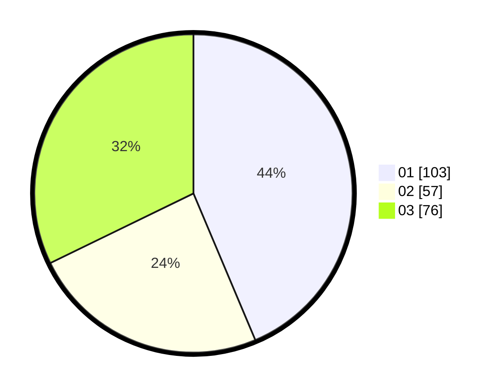

# Hasil

Hasil perolehan suara paslon dapat dilihat pada file paslon-01.txt, paslon-02.txt, dan paslon-03.txt.

Jika tidak ada, artinya data tersebut belum ada pada SIREKAP.

## Perolehan Suara

 * Paslon 01: **103**.
 * Paslon 02: **57**.
 * Paslon 03: **76**.

## Foto C Plano

https://sirekap-obj-formc.kpu.go.id/0d20/pemilu/ppwp/31/74/04/10/06/3174041006042-20240214-155408--9d50e9b4-db42-4622-950f-9981f65578d7.jpg

https://sirekap-obj-formc.kpu.go.id/0d20/pemilu/ppwp/31/74/04/10/06/3174041006042-20240214-193547--c828f2f1-d92b-410a-9f18-457d92e9e107.jpg

https://sirekap-obj-formc.kpu.go.id/0d20/pemilu/ppwp/31/74/04/10/06/3174041006042-20240214-155437--8b47c4d5-8bda-4f3e-877d-eb6d1e714232.jpg

## DATA PEMILIH TETAP

Jumlah pemilih dalam DPT: **276**.
 * L: **118**.
 * P: **158**.

## DATA PENGGUNA HAK PILIH

Jumlah pengguna hak pilih dalam DPT: **230**.
 * L: **102**.
 * P: **128**.

Jumlah pengguna hak pilih dalam DPTb: **12**.
 * L: **4**.
 * P: **8**.

Jumlah pengguna hak pilih dalam DPK: **1**.
 * L: **1**.
 * P: **0**.

Jumlah pengguna hak pilih: **243**.
 * L: **107**.
 * P: **136**.

## JUMLAH SUARA SAH DAN TIDAK SAH

JUMLAH SELURUH SUARA SAH: **236**.

JUMLAH SUARA TIDAK SAH: **7**.

JUMLAH SELURUH SUARA SAH DAN SUARA TIDAK SAH: **243**.
