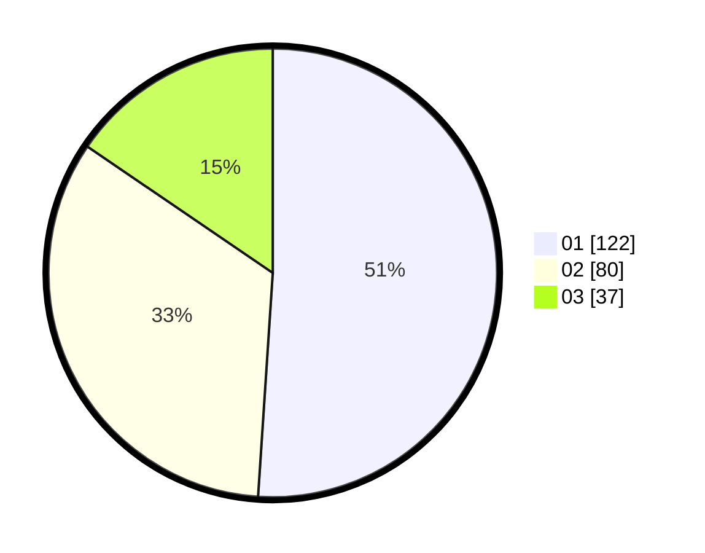

# Hasil

Hasil perolehan suara paslon dapat dilihat pada file paslon-01.txt, paslon-02.txt, dan paslon-03.txt.

Jika tidak ada, artinya data tersebut belum ada pada SIREKAP.

## Perolehan Suara

 * Paslon 01: **122**.
 * Paslon 02: **80**.
 * Paslon 03: **37**.

## Foto C Plano

https://sirekap-obj-formc.kpu.go.id/88d6/pemilu/ppwp/31/74/04/10/06/3174041006043-20240215-030715--0b9daee4-6935-4a1e-9a63-599cab65220e.jpg

https://sirekap-obj-formc.kpu.go.id/88d6/pemilu/ppwp/31/74/04/10/06/3174041006043-20240215-033946--e805757f-d640-449b-97d6-e353759b9d51.jpg

https://sirekap-obj-formc.kpu.go.id/88d6/pemilu/ppwp/31/74/04/10/06/3174041006043-20240215-034109--f12855e1-b8b3-48dc-a32e-61e92675db3b.jpg

## DATA PEMILIH TETAP

Jumlah pemilih dalam DPT: **276**.
 * L: **138**.
 * P: **138**.

## DATA PENGGUNA HAK PILIH

Jumlah pengguna hak pilih dalam DPT: **238**.
 * L: **124**.
 * P: **114**.

Jumlah pengguna hak pilih dalam DPTb: **2**.
 * L: **1**.
 * P: **1**.

Jumlah pengguna hak pilih dalam DPK: **0**.
 * L: **0**.
 * P: **0**.

Jumlah pengguna hak pilih: **240**.
 * L: **125**.
 * P: **115**.

## JUMLAH SUARA SAH DAN TIDAK SAH

JUMLAH SELURUH SUARA SAH: **239**.

JUMLAH SUARA TIDAK SAH: **1**.

JUMLAH SELURUH SUARA SAH DAN SUARA TIDAK SAH: **240**.
