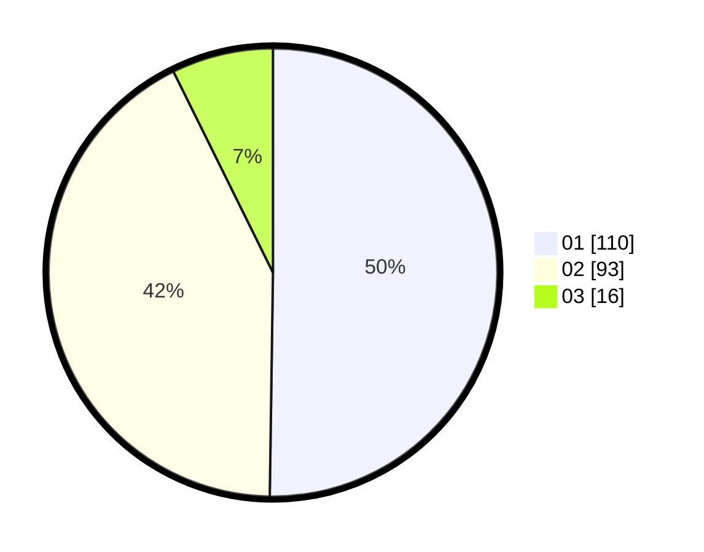

# Hasil

Hasil perolehan suara paslon dapat dilihat pada file paslon-01.txt, paslon-02.txt, dan paslon-03.txt.

Jika tidak ada, artinya data tersebut belum ada pada SIREKAP.

## Perolehan Suara

 * Paslon 01: **110**.
 * Paslon 02: **93**.
 * Paslon 03: **16**.

## Foto C Plano

https://sirekap-obj-formc.kpu.go.id/6d1d/pemilu/ppwp/31/74/04/10/06/3174041006045-20240214-162227--62169c12-a3a2-4e09-97ea-cd0d0a4ab80e.jpg

https://sirekap-obj-formc.kpu.go.id/6d1d/pemilu/ppwp/31/74/04/10/06/3174041006045-20240214-184936--5c56210c-678b-4fd9-b48b-8791b8c53e85.jpg

https://sirekap-obj-formc.kpu.go.id/6d1d/pemilu/ppwp/31/74/04/10/06/3174041006045-20240214-162245--107ea88b-9b24-4ccb-9991-0c855f8d05ba.jpg

## DATA PEMILIH TETAP

Jumlah pemilih dalam DPT: **272**.
 * L: **140**.
 * P: **132**.

## DATA PENGGUNA HAK PILIH

Jumlah pengguna hak pilih dalam DPT: **214**.
 * L: **100**.
 * P: **114**.

Jumlah pengguna hak pilih dalam DPTb: **2**.
 * L: **1**.
 * P: **1**.

Jumlah pengguna hak pilih dalam DPK: **4**.
 * L: **3**.
 * P: **1**.

Jumlah pengguna hak pilih: **220**.
 * L: **104**.
 * P: **116**.

## JUMLAH SUARA SAH DAN TIDAK SAH

JUMLAH SELURUH SUARA SAH: **219**.

JUMLAH SUARA TIDAK SAH: **1**.

JUMLAH SELURUH SUARA SAH DAN SUARA TIDAK SAH: **220**.
