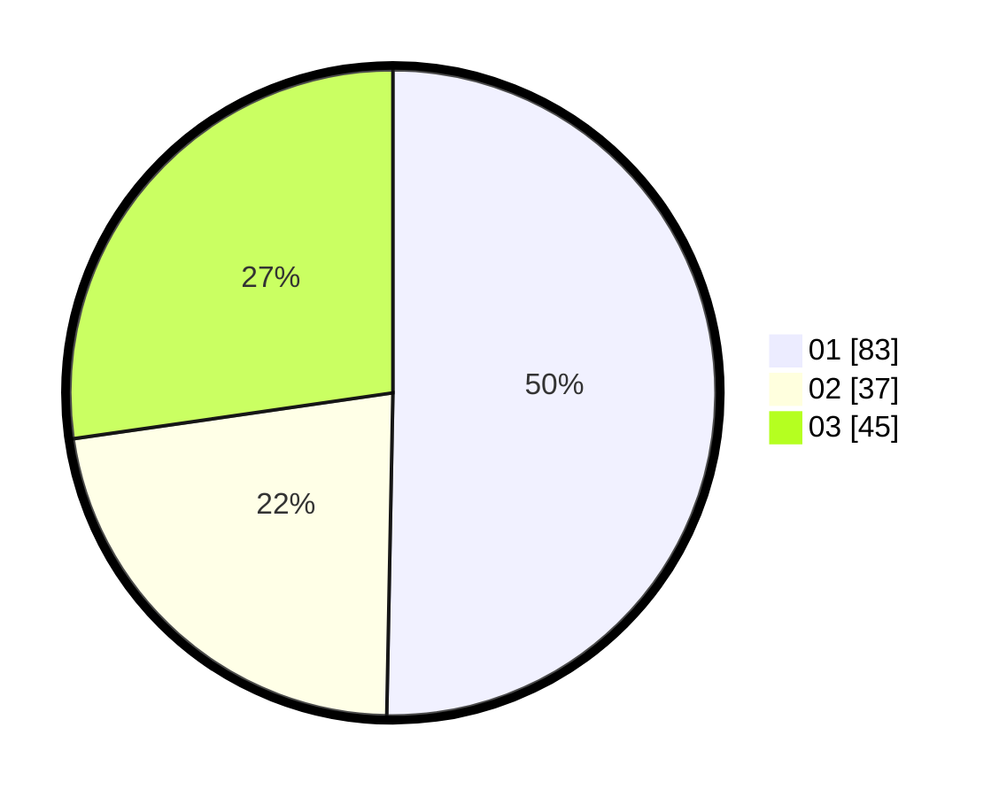

# Hasil

Hasil perolehan suara paslon dapat dilihat pada file paslon-01.txt, paslon-02.txt, dan paslon-03.txt.

Jika tidak ada, artinya data tersebut belum ada pada SIREKAP.

## Perolehan Suara

 * Paslon 01: **83**.
 * Paslon 02: **37**.
 * Paslon 03: **45**.

## Foto C Plano

https://sirekap-obj-formc.kpu.go.id/39c0/pemilu/ppwp/31/74/04/10/06/3174041006047-20240214-195940--df796346-f31b-4a8f-9a28-239867001b2a.jpg

https://sirekap-obj-formc.kpu.go.id/39c0/pemilu/ppwp/31/74/04/10/06/3174041006047-20240214-195958--59db258e-fbc9-4fc4-849e-1d6675c6e916.jpg

https://sirekap-obj-formc.kpu.go.id/39c0/pemilu/ppwp/31/74/04/10/06/3174041006047-20240214-200016--c03ec00a-7813-4ee3-aab1-94414278416b.jpg

## DATA PEMILIH TETAP

Jumlah pemilih dalam DPT: **268**.
 * L: **133**.
 * P: **135**.

## DATA PENGGUNA HAK PILIH

Jumlah pengguna hak pilih dalam DPT: **263**.
 * L: **130**.
 * P: **133**.

Jumlah pengguna hak pilih dalam DPTb: **3**.
 * L: **2**.
 * P: **1**.

Jumlah pengguna hak pilih dalam DPK: **2**.
 * L: **1**.
 * P: **1**.

Jumlah pengguna hak pilih: **266**.
 * L: **133**.
 * P: **135**.

## JUMLAH SUARA SAH DAN TIDAK SAH

JUMLAH SELURUH SUARA SAH: **219**.

JUMLAH SUARA TIDAK SAH: **6**.

JUMLAH SELURUH SUARA SAH DAN SUARA TIDAK SAH: **727**.
