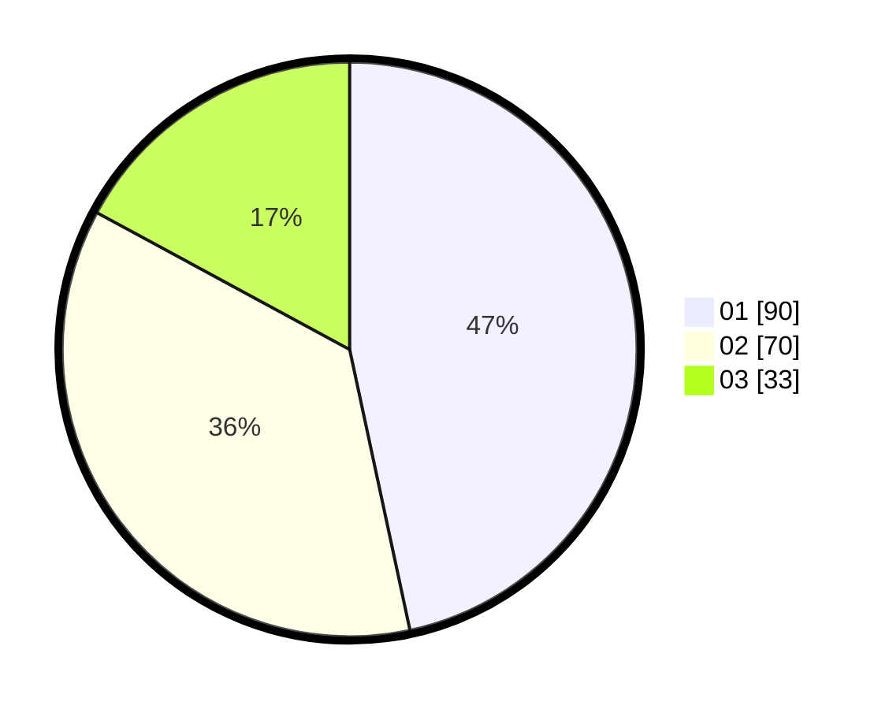

# Hasil

Hasil perolehan suara paslon dapat dilihat pada file paslon-01.txt, paslon-02.txt, dan paslon-03.txt.

Jika tidak ada, artinya data tersebut belum ada pada SIREKAP.

## Perolehan Suara

 * Paslon 01: **90**.
 * Paslon 02: **70**.
 * Paslon 03: **33**.

## Foto C Plano

https://sirekap-obj-formc.kpu.go.id/a7b4/pemilu/ppwp/31/74/04/10/06/3174041006053-20240214-192010--871d5f4d-3645-47cd-b107-bfe78270ce0f.jpg

https://sirekap-obj-formc.kpu.go.id/a7b4/pemilu/ppwp/31/74/04/10/06/3174041006053-20240214-192206--a44e23b4-9567-4ea5-b5a7-098894ef6d85.jpg

https://sirekap-obj-formc.kpu.go.id/a7b4/pemilu/ppwp/31/74/04/10/06/3174041006053-20240214-192409--f26b04bc-81b9-457d-b5ed-5e419cb6ef69.jpg

## DATA PEMILIH TETAP

Jumlah pemilih dalam DPT: **239**.
 * L: **122**.
 * P: **117**.

## DATA PENGGUNA HAK PILIH

Jumlah pengguna hak pilih dalam DPT: **193**.
 * L: **97**.
 * P: **96**.

Jumlah pengguna hak pilih dalam DPTb: **2**.
 * L: **1**.
 * P: **1**.

Jumlah pengguna hak pilih dalam DPK: **1**.
 * L: **0**.
 * P: **1**.

Jumlah pengguna hak pilih: **196**.
 * L: **98**.
 * P: **98**.

## JUMLAH SUARA SAH DAN TIDAK SAH

JUMLAH SELURUH SUARA SAH: **193**.

JUMLAH SUARA TIDAK SAH: **3**.

JUMLAH SELURUH SUARA SAH DAN SUARA TIDAK SAH: **196**.
