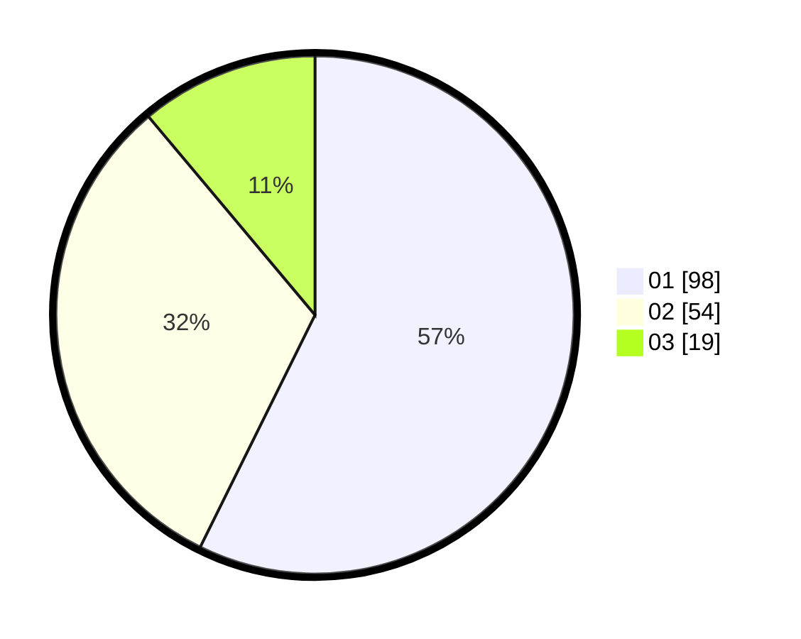

# Hasil

Hasil perolehan suara paslon dapat dilihat pada file paslon-01.txt, paslon-02.txt, dan paslon-03.txt.

Jika tidak ada, artinya data tersebut belum ada pada SIREKAP.

## Perolehan Suara

 * Paslon 01: **98**.
 * Paslon 02: **54**.
 * Paslon 03: **19**.

## Foto C Plano

https://sirekap-obj-formc.kpu.go.id/6877/pemilu/ppwp/31/74/04/10/06/3174041006055-20240214-214242--18324b37-8f56-437d-895e-c25f609cca0c.jpg

https://sirekap-obj-formc.kpu.go.id/6877/pemilu/ppwp/31/74/04/10/06/3174041006055-20240214-214309--277ebe57-7aed-4b74-b3ff-4068f4e17244.jpg

https://sirekap-obj-formc.kpu.go.id/6877/pemilu/ppwp/31/74/04/10/06/3174041006055-20240214-214330--b1df4cbc-6ba3-4fcc-8792-3fc530f2c034.jpg
