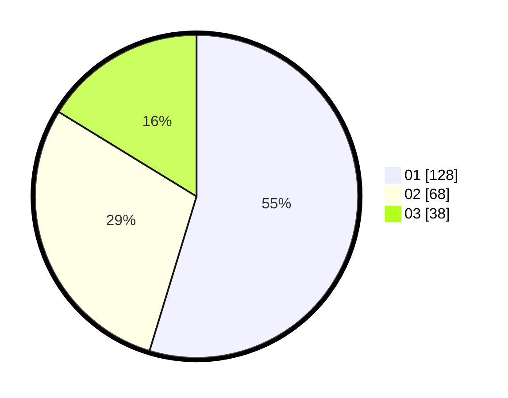

# Hasil

Hasil perolehan suara paslon dapat dilihat pada file paslon-01.txt, paslon-02.txt, dan paslon-03.txt.

Jika tidak ada, artinya data tersebut belum ada pada SIREKAP.

## Perolehan Suara

 * Paslon 01: **128**.
 * Paslon 02: **68**.
 * Paslon 03: **38**.

## Foto C Plano

https://sirekap-obj-formc.kpu.go.id/fc56/pemilu/ppwp/31/74/04/10/06/3174041006056-20240214-155547--2aa5a5cb-1883-4f1b-83b3-726b2d6356a2.jpg

https://sirekap-obj-formc.kpu.go.id/fc56/pemilu/ppwp/31/74/04/10/06/3174041006056-20240214-184519--f34d39bd-3082-4c66-bc13-f469eaef5dab.jpg

https://sirekap-obj-formc.kpu.go.id/fc56/pemilu/ppwp/31/74/04/10/06/3174041006056-20240214-155335--54143ea1-cf6b-4b08-bf35-b4ac90f897bb.jpg

## DATA PEMILIH TETAP

Jumlah pemilih dalam DPT: **272**.
 * L: **127**.
 * P: **145**.

## DATA PENGGUNA HAK PILIH

Jumlah pengguna hak pilih dalam DPT: **233**.
 * L: **105**.
 * P: **128**.

Jumlah pengguna hak pilih dalam DPTb: **0**.
 * L: **0**.
 * P: **0**.

Jumlah pengguna hak pilih dalam DPK: **4**.
 * L: **1**.
 * P: **3**.

Jumlah pengguna hak pilih: **237**.
 * L: **106**.
 * P: **131**.

## JUMLAH SUARA SAH DAN TIDAK SAH

JUMLAH SELURUH SUARA SAH: **234**.

JUMLAH SUARA TIDAK SAH: **3**.

JUMLAH SELURUH SUARA SAH DAN SUARA TIDAK SAH: **237**.
