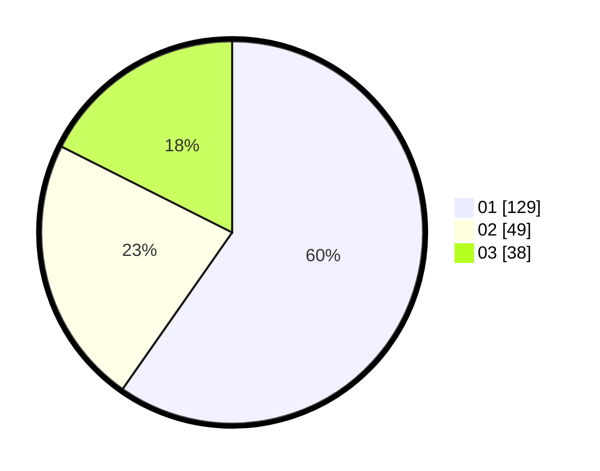

# Hasil

Hasil perolehan suara paslon dapat dilihat pada file paslon-01.txt, paslon-02.txt, dan paslon-03.txt.

Jika tidak ada, artinya data tersebut belum ada pada SIREKAP.

## Perolehan Suara

 * Paslon 01: **129**.
 * Paslon 02: **49**.
 * Paslon 03: **38**.

## Foto C Plano

https://sirekap-obj-formc.kpu.go.id/f228/pemilu/ppwp/31/74/04/10/06/3174041006058-20240214-194246--c488bb4a-3f9a-4b9b-9232-ef17ba4154cf.jpg

https://sirekap-obj-formc.kpu.go.id/f228/pemilu/ppwp/31/74/04/10/06/3174041006058-20240214-200021--0e241eed-23b5-478b-b824-0f7c7794cc91.jpg

https://sirekap-obj-formc.kpu.go.id/f228/pemilu/ppwp/31/74/04/10/06/3174041006058-20240214-195447--c70f46cb-5e16-4e41-859e-02407965a340.jpg

## DATA PEMILIH TETAP

Jumlah pemilih dalam DPT: **252**.
 * L: **135**.
 * P: **117**.

## DATA PENGGUNA HAK PILIH

Jumlah pengguna hak pilih dalam DPT: **209**.
 * L: **108**.
 * P: **101**.

Jumlah pengguna hak pilih dalam DPTb: **3**.
 * L: **1**.
 * P: **2**.

Jumlah pengguna hak pilih dalam DPK: **7**.
 * L: **6**.
 * P: **1**.

Jumlah pengguna hak pilih: **219**.
 * L: **115**.
 * P: **104**.

## JUMLAH SUARA SAH DAN TIDAK SAH

JUMLAH SELURUH SUARA SAH: **216**.

JUMLAH SUARA TIDAK SAH: **3**.

JUMLAH SELURUH SUARA SAH DAN SUARA TIDAK SAH: **219**.
