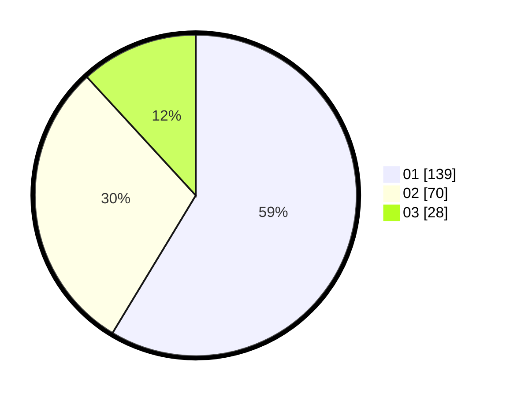

# Hasil

Hasil perolehan suara paslon dapat dilihat pada file paslon-01.txt, paslon-02.txt, dan paslon-03.txt.

Jika tidak ada, artinya data tersebut belum ada pada SIREKAP.

## Perolehan Suara

 * Paslon 01: **139**.
 * Paslon 02: **70**.
 * Paslon 03: **28**.

## Foto C Plano

https://sirekap-obj-formc.kpu.go.id/a468/pemilu/ppwp/31/74/04/10/06/3174041006059-20240214-202657--0e6a4fa5-f4a8-4885-b4cf-60b982ea6a87.jpg

https://sirekap-obj-formc.kpu.go.id/a468/pemilu/ppwp/31/74/04/10/06/3174041006059-20240214-205551--cc2f0386-4d0b-4eb8-a01f-0de74d8c765b.jpg

https://sirekap-obj-formc.kpu.go.id/a468/pemilu/ppwp/31/74/04/10/06/3174041006059-20240214-211957--2256da5c-52c3-4cd2-8a57-06d8863c4831.jpg

## DATA PEMILIH TETAP

Jumlah pemilih dalam DPT: **280**.
 * L: **140**.
 * P: **140**.

## DATA PENGGUNA HAK PILIH

Jumlah pengguna hak pilih dalam DPT: **225**.
 * L: **106**.
 * P: **119**.

Jumlah pengguna hak pilih dalam DPTb: **8**.
 * L: **4**.
 * P: **4**.

Jumlah pengguna hak pilih dalam DPK: **7**.
 * L: **2**.
 * P: **5**.

Jumlah pengguna hak pilih: **240**.
 * L: **112**.
 * P: **128**.

## JUMLAH SUARA SAH DAN TIDAK SAH

JUMLAH SELURUH SUARA SAH: **237**.

JUMLAH SUARA TIDAK SAH: **3**.

JUMLAH SELURUH SUARA SAH DAN SUARA TIDAK SAH: **240**.
