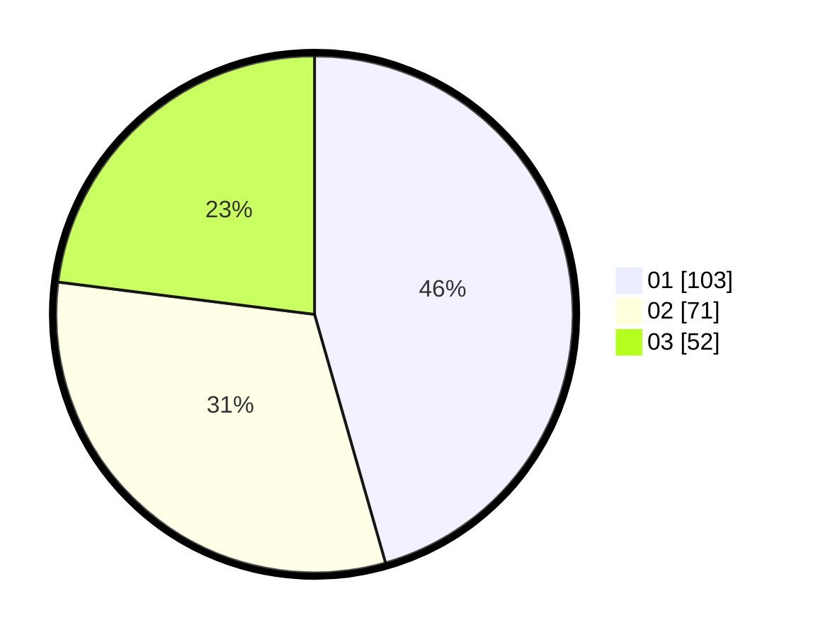

# Hasil

Hasil perolehan suara paslon dapat dilihat pada file paslon-01.txt, paslon-02.txt, dan paslon-03.txt.

Jika tidak ada, artinya data tersebut belum ada pada SIREKAP.

## Perolehan Suara

 * Paslon 01: **103**.
 * Paslon 02: **71**.
 * Paslon 03: **52**.

## Foto C Plano

https://sirekap-obj-formc.kpu.go.id/41fa/pemilu/ppwp/31/74/04/10/06/3174041006075-20240217-091648--54061efa-58d8-4308-afa6-f8acf87cbe1b.jpg

https://sirekap-obj-formc.kpu.go.id/41fa/pemilu/ppwp/31/74/04/10/06/3174041006075-20240217-091833--07f66aaf-915c-4a48-a05c-6640deba4482.jpg

https://sirekap-obj-formc.kpu.go.id/41fa/pemilu/ppwp/31/74/04/10/06/3174041006075-20240217-091959--220380a9-0fa2-458f-b72e-5286005aca4c.jpg

## DATA PEMILIH TETAP

Jumlah pemilih dalam DPT: **269**.
 * L: **140**.
 * P: **129**.

## DATA PENGGUNA HAK PILIH

Jumlah pengguna hak pilih dalam DPT: **211**.
 * L: **105**.
 * P: **106**.

Jumlah pengguna hak pilih dalam DPTb: **16**.
 * L: **2**.
 * P: **14**.

Jumlah pengguna hak pilih dalam DPK: **3**.
 * L: **2**.
 * P: **1**.

Jumlah pengguna hak pilih: **230**.
 * L: **109**.
 * P: **121**.

## JUMLAH SUARA SAH DAN TIDAK SAH

JUMLAH SELURUH SUARA SAH: **226**.

JUMLAH SUARA TIDAK SAH: **4**.

JUMLAH SELURUH SUARA SAH DAN SUARA TIDAK SAH: **230**.
