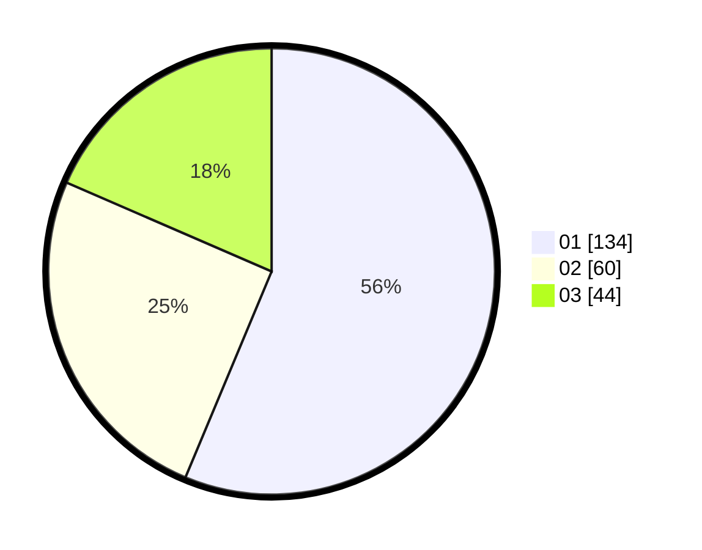

# Hasil

Hasil perolehan suara paslon dapat dilihat pada file paslon-01.txt, paslon-02.txt, dan paslon-03.txt.

Jika tidak ada, artinya data tersebut belum ada pada SIREKAP.

## Perolehan Suara

 * Paslon 01: **134**.
 * Paslon 02: **60**.
 * Paslon 03: **44**.

## Foto C Plano

https://sirekap-obj-formc.kpu.go.id/2ebf/pemilu/ppwp/31/74/04/10/06/3174041006078-20240214-155739--036057ea-20a5-4259-9886-f19996bee1da.jpg

https://sirekap-obj-formc.kpu.go.id/2ebf/pemilu/ppwp/31/74/04/10/06/3174041006078-20240214-155843--22a21a83-ca24-480f-a686-2f650b8d8eac.jpg

https://sirekap-obj-formc.kpu.go.id/2ebf/pemilu/ppwp/31/74/04/10/06/3174041006078-20240214-175918--a89073de-09d6-495c-9a52-e4a104f8ca66.jpg

## DATA PEMILIH TETAP

Jumlah pemilih dalam DPT: **267**.
 * L: **128**.
 * P: **139**.

## DATA PENGGUNA HAK PILIH

Jumlah pengguna hak pilih dalam DPT: **227**.
 * L: **106**.
 * P: **121**.

Jumlah pengguna hak pilih dalam DPTb: **11**.
 * L: **2**.
 * P: **9**.

Jumlah pengguna hak pilih dalam DPK: **0**.
 * L: **0**.
 * P: **0**.

Jumlah pengguna hak pilih: **238**.
 * L: **108**.
 * P: **130**.

## JUMLAH SUARA SAH DAN TIDAK SAH

JUMLAH SELURUH SUARA SAH: **238**.

JUMLAH SUARA TIDAK SAH: **5**.

JUMLAH SELURUH SUARA SAH DAN SUARA TIDAK SAH: **243**.
