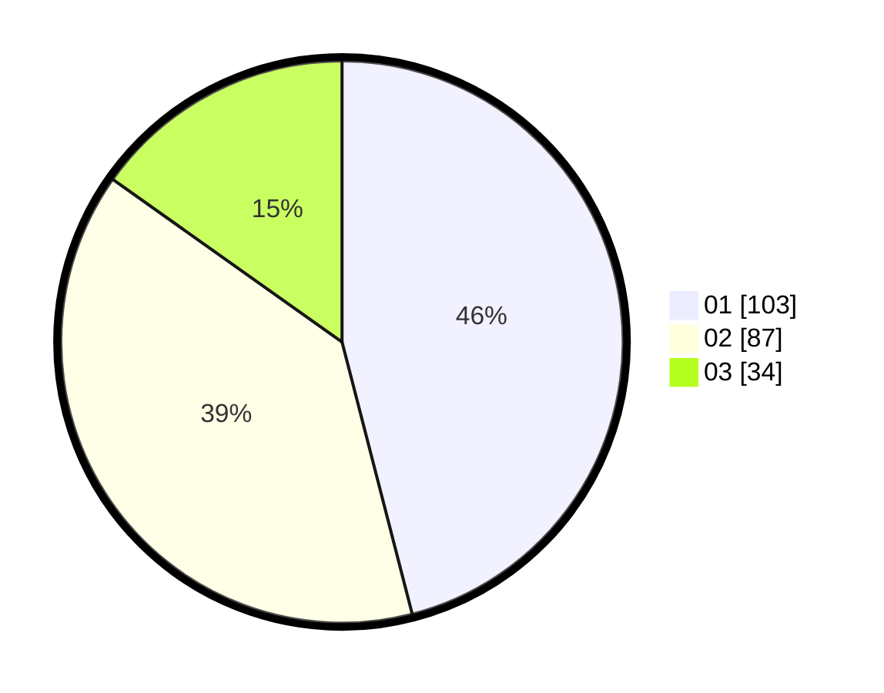

# Hasil

Hasil perolehan suara paslon dapat dilihat pada file paslon-01.txt, paslon-02.txt, dan paslon-03.txt.

Jika tidak ada, artinya data tersebut belum ada pada SIREKAP.

## Perolehan Suara

 * Paslon 01: **103**.
 * Paslon 02: **87**.
 * Paslon 03: **34**.

## Foto C Plano

https://sirekap-obj-formc.kpu.go.id/1d7d/pemilu/ppwp/31/74/04/10/06/3174041006079-20240216-212607--f0656df0-eaf3-46cc-82f0-4e04d058234a.jpg

https://sirekap-obj-formc.kpu.go.id/1d7d/pemilu/ppwp/31/74/04/10/06/3174041006079-20240216-233805--d6ac836a-a542-4945-bdbc-30786511bc1c.jpg

https://sirekap-obj-formc.kpu.go.id/1d7d/pemilu/ppwp/31/74/04/10/06/3174041006079-20240216-213829--8c56f246-6408-4dbe-b564-b3300869b8ba.jpg

## DATA PEMILIH TETAP

Jumlah pemilih dalam DPT: **272**.
 * L: **139**.
 * P: **133**.

## DATA PENGGUNA HAK PILIH

Jumlah pengguna hak pilih dalam DPT: **203**.
 * L: **102**.
 * P: **101**.

Jumlah pengguna hak pilih dalam DPTb: **23**.
 * L: **10**.
 * P: **13**.

Jumlah pengguna hak pilih dalam DPK: **1**.
 * L: **1**.
 * P: **0**.

Jumlah pengguna hak pilih: **227**.
 * L: **113**.
 * P: **114**.

## JUMLAH SUARA SAH DAN TIDAK SAH

JUMLAH SELURUH SUARA SAH: **224**.

JUMLAH SUARA TIDAK SAH: **3**.

JUMLAH SELURUH SUARA SAH DAN SUARA TIDAK SAH: **227**.
