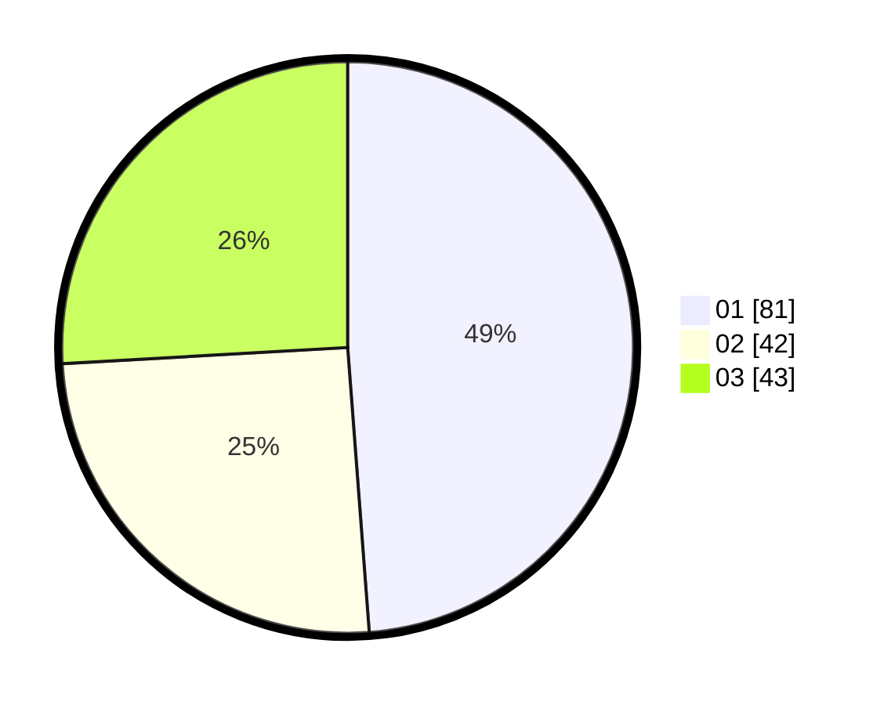

# Hasil

Hasil perolehan suara paslon dapat dilihat pada file paslon-01.txt, paslon-02.txt, dan paslon-03.txt.

Jika tidak ada, artinya data tersebut belum ada pada SIREKAP.

## Perolehan Suara

 * Paslon 01: **81**.
 * Paslon 02: **42**.
 * Paslon 03: **43**.

## Foto C Plano

https://sirekap-obj-formc.kpu.go.id/e599/pemilu/ppwp/31/74/04/10/06/3174041006080-20240215-190230--7c563a33-6257-4ca4-9ef8-9479c406005c.jpg

https://sirekap-obj-formc.kpu.go.id/e599/pemilu/ppwp/31/74/04/10/06/3174041006080-20240214-155133--993abb2f-3a34-487b-a44b-26a089fe3abb.jpg

https://sirekap-obj-formc.kpu.go.id/e599/pemilu/ppwp/31/74/04/10/06/3174041006080-20240214-155223--3161cbc0-23bd-401e-b058-cd8b3e09583f.jpg

## DATA PEMILIH TETAP

Jumlah pemilih dalam DPT: **245**.
 * L: **121**.
 * P: **124**.

## DATA PENGGUNA HAK PILIH

Jumlah pengguna hak pilih dalam DPT: **192**.
 * L: **84**.
 * P: **108**.

Jumlah pengguna hak pilih dalam DPTb: **12**.
 * L: **0**.
 * P: **12**.

Jumlah pengguna hak pilih dalam DPK: **3**.
 * L: **2**.
 * P: **1**.

Jumlah pengguna hak pilih: **207**.
 * L: **86**.
 * P: **121**.

## JUMLAH SUARA SAH DAN TIDAK SAH

JUMLAH SELURUH SUARA SAH: **206**.

JUMLAH SUARA TIDAK SAH: **1**.

JUMLAH SELURUH SUARA SAH DAN SUARA TIDAK SAH: **207**.
