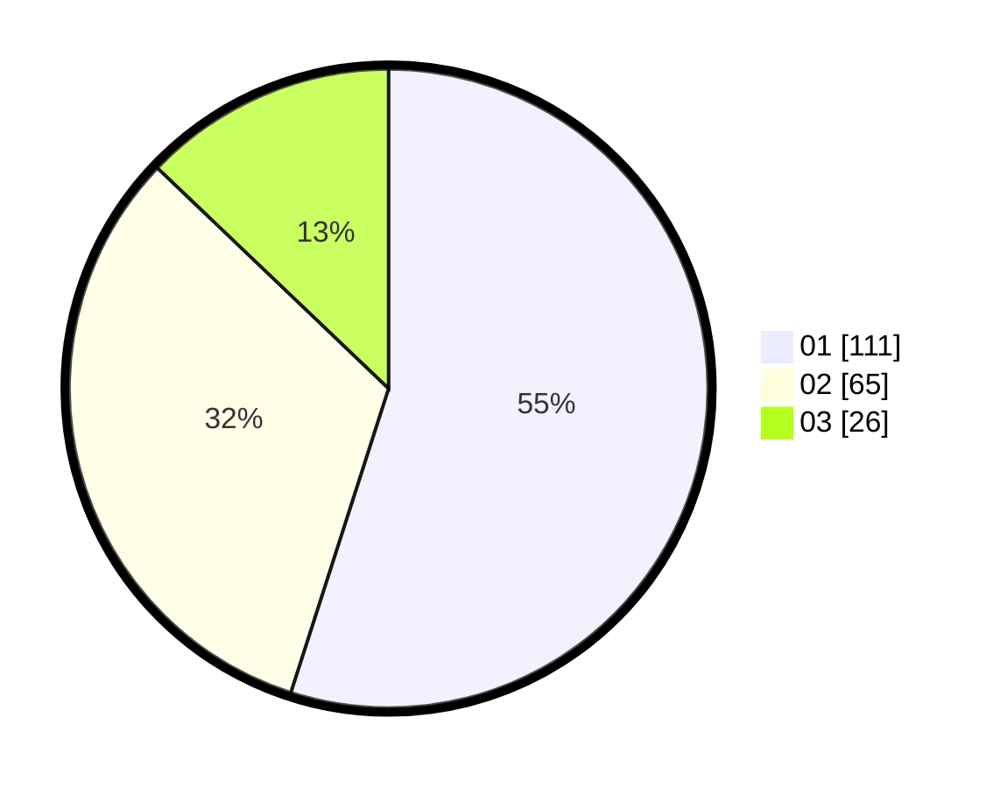

# Hasil

Hasil perolehan suara paslon dapat dilihat pada file paslon-01.txt, paslon-02.txt, dan paslon-03.txt.

Jika tidak ada, artinya data tersebut belum ada pada SIREKAP.

## Perolehan Suara

 * Paslon 01: **111**.
 * Paslon 02: **65**.
 * Paslon 03: **26**.

## Foto C Plano

https://sirekap-obj-formc.kpu.go.id/9c5c/pemilu/ppwp/31/74/04/10/06/3174041006081-20240214-193523--c82a44ff-f662-45ee-9144-184c9a560870.jpg

https://sirekap-obj-formc.kpu.go.id/9c5c/pemilu/ppwp/31/74/04/10/06/3174041006081-20240215-005155--cca5a788-2b19-472b-abc4-eb75efe557e6.jpg

https://sirekap-obj-formc.kpu.go.id/9c5c/pemilu/ppwp/31/74/04/10/06/3174041006081-20240214-193936--02829e8b-5fbf-4e5b-a509-be8017184ddf.jpg

## DATA PEMILIH TETAP

Jumlah pemilih dalam DPT: **249**.
 * L: **105**.
 * P: **144**.

## DATA PENGGUNA HAK PILIH

Jumlah pengguna hak pilih dalam DPT: **195**.
 * L: **83**.
 * P: **112**.

Jumlah pengguna hak pilih dalam DPTb: **7**.
 * L: **3**.
 * P: **4**.

Jumlah pengguna hak pilih dalam DPK: **0**.
 * L: **0**.
 * P: **0**.

Jumlah pengguna hak pilih: **202**.
 * L: **86**.
 * P: **116**.

## JUMLAH SUARA SAH DAN TIDAK SAH

JUMLAH SELURUH SUARA SAH: **202**.

JUMLAH SUARA TIDAK SAH: **0**.

JUMLAH SELURUH SUARA SAH DAN SUARA TIDAK SAH: **202**.
