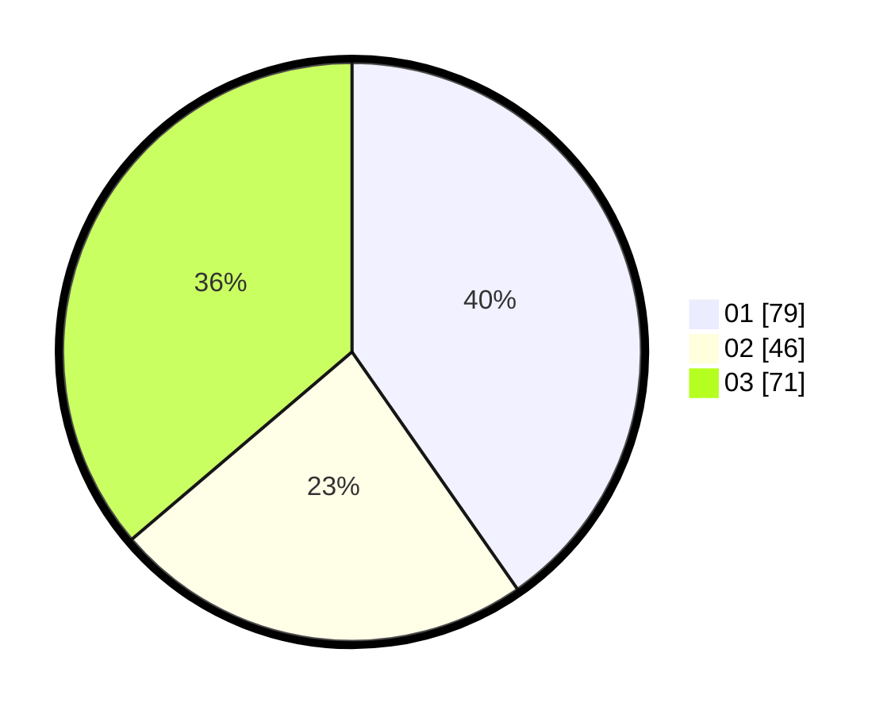

# Hasil

Hasil perolehan suara paslon dapat dilihat pada file paslon-01.txt, paslon-02.txt, dan paslon-03.txt.

Jika tidak ada, artinya data tersebut belum ada pada SIREKAP.

## Perolehan Suara

 * Paslon 01: **79**.
 * Paslon 02: **46**.
 * Paslon 03: **71**.

## Foto C Plano

https://sirekap-obj-formc.kpu.go.id/6d5c/pemilu/ppwp/31/74/04/10/06/3174041006083-20240214-190020--d4786e2b-140d-4a77-9930-d72a350906a5.jpg

https://sirekap-obj-formc.kpu.go.id/6d5c/pemilu/ppwp/31/74/04/10/06/3174041006083-20240214-184535--44915c39-09f1-4a40-b752-61feb8c1d22e.jpg

https://sirekap-obj-formc.kpu.go.id/6d5c/pemilu/ppwp/31/74/04/10/06/3174041006083-20240214-184518--8055b8e4-4303-47fb-91c4-e890c86269b1.jpg
