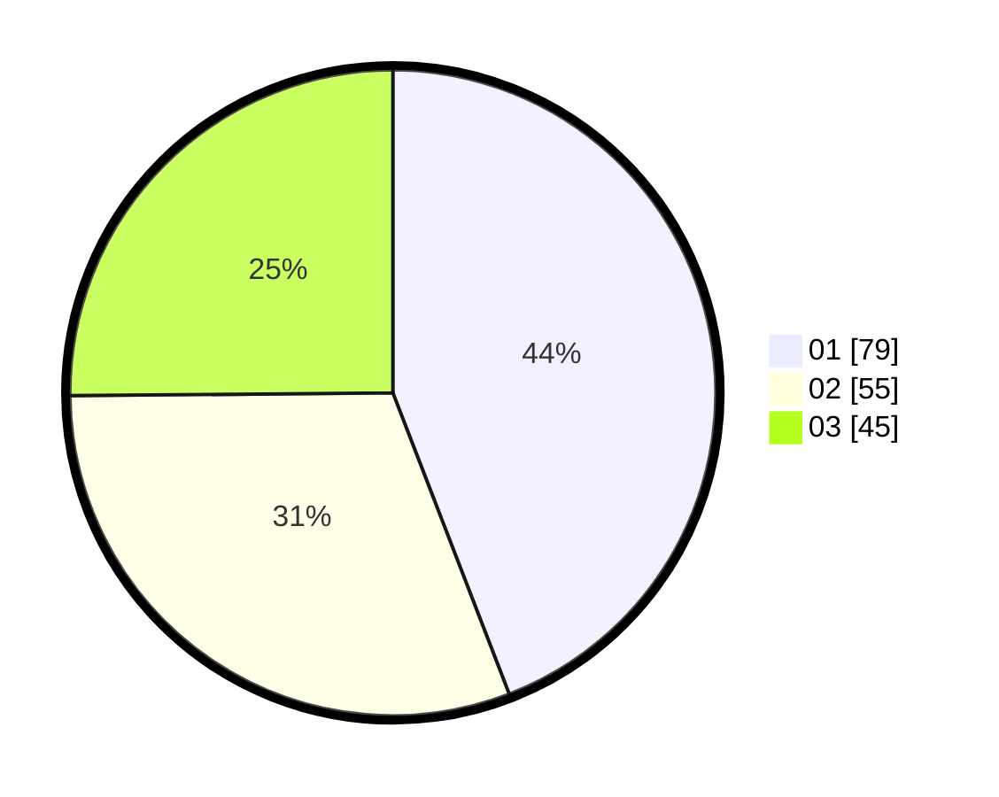

# Hasil

Hasil perolehan suara paslon dapat dilihat pada file paslon-01.txt, paslon-02.txt, dan paslon-03.txt.

Jika tidak ada, artinya data tersebut belum ada pada SIREKAP.

## Perolehan Suara

 * Paslon 01: **79**.
 * Paslon 02: **55**.
 * Paslon 03: **45**.

## Foto C Plano

https://sirekap-obj-formc.kpu.go.id/9046/pemilu/ppwp/31/74/04/10/06/3174041006086-20240214-191920--f0133d35-394d-4b8d-8fb9-dc4f8965fa09.jpg

https://sirekap-obj-formc.kpu.go.id/9046/pemilu/ppwp/31/74/04/10/06/3174041006086-20240214-191945--fd743b51-8dd5-4256-ba8a-fd06d2a35a77.jpg

https://sirekap-obj-formc.kpu.go.id/9046/pemilu/ppwp/31/74/04/10/06/3174041006086-20240214-210902--7a7fc323-c954-4ced-994f-a9c938fedaf3.jpg

## DATA PEMILIH TETAP

Jumlah pemilih dalam DPT: **224**.
 * L: **112**.
 * P: **112**.

## DATA PENGGUNA HAK PILIH

Jumlah pengguna hak pilih dalam DPT: **175**.
 * L: **89**.
 * P: **86**.

Jumlah pengguna hak pilih dalam DPTb: **4**.
 * L: **2**.
 * P: **2**.

Jumlah pengguna hak pilih dalam DPK: **1**.
 * L: **0**.
 * P: **1**.

Jumlah pengguna hak pilih: **180**.
 * L: **91**.
 * P: **89**.

## JUMLAH SUARA SAH DAN TIDAK SAH

JUMLAH SELURUH SUARA SAH: **179**.

JUMLAH SUARA TIDAK SAH: **1**.

JUMLAH SELURUH SUARA SAH DAN SUARA TIDAK SAH: **180**.
