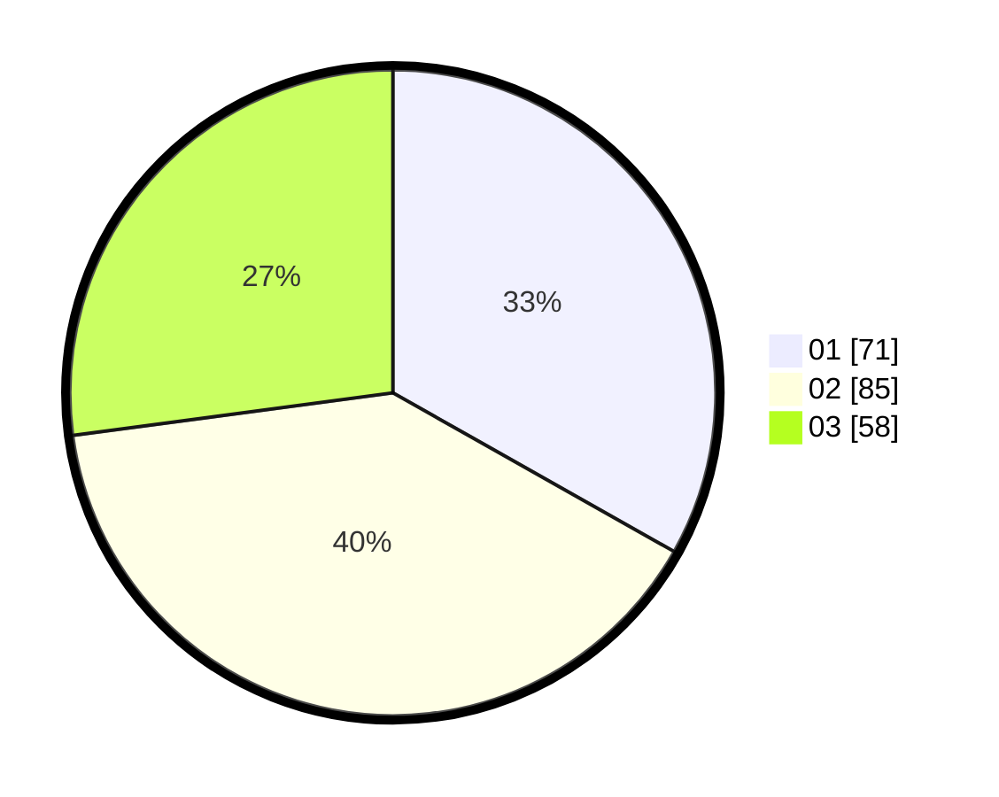

# Hasil

Hasil perolehan suara paslon dapat dilihat pada file paslon-01.txt, paslon-02.txt, dan paslon-03.txt.

Jika tidak ada, artinya data tersebut belum ada pada SIREKAP.

## Perolehan Suara

 * Paslon 01: **71**.
 * Paslon 02: **85**.
 * Paslon 03: **58**.

## Foto C Plano

https://sirekap-obj-formc.kpu.go.id/fb3c/pemilu/ppwp/31/74/04/10/06/3174041006087-20240216-135332--2186e99c-9b9c-4b04-b25e-b78ed890cf32.jpg

https://sirekap-obj-formc.kpu.go.id/fb3c/pemilu/ppwp/31/74/04/10/06/3174041006087-20240214-191704--768e7386-51f9-4c74-beb6-4f0e0487c916.jpg

https://sirekap-obj-formc.kpu.go.id/fb3c/pemilu/ppwp/31/74/04/10/06/3174041006087-20240214-191709--4c3437f7-be76-4753-809c-c47922221a1d.jpg

## DATA PEMILIH TETAP

Jumlah pemilih dalam DPT: **262**.
 * L: **125**.
 * P: **137**.

## DATA PENGGUNA HAK PILIH

Jumlah pengguna hak pilih dalam DPT: **203**.
 * L: **95**.
 * P: **108**.

Jumlah pengguna hak pilih dalam DPTb: **15**.
 * L: **4**.
 * P: **11**.

Jumlah pengguna hak pilih dalam DPK: **1**.
 * L: **0**.
 * P: **1**.

Jumlah pengguna hak pilih: **219**.
 * L: **99**.
 * P: **120**.

## JUMLAH SUARA SAH DAN TIDAK SAH

JUMLAH SELURUH SUARA SAH: **214**.

JUMLAH SUARA TIDAK SAH: **5**.

JUMLAH SELURUH SUARA SAH DAN SUARA TIDAK SAH: **219**.
