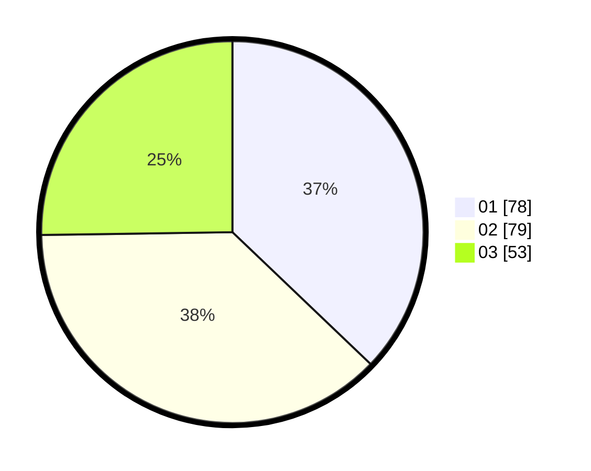

# Hasil

Hasil perolehan suara paslon dapat dilihat pada file paslon-01.txt, paslon-02.txt, dan paslon-03.txt.

Jika tidak ada, artinya data tersebut belum ada pada SIREKAP.

## Perolehan Suara

 * Paslon 01: **78**.
 * Paslon 02: **79**.
 * Paslon 03: **53**.

## Foto C Plano

https://sirekap-obj-formc.kpu.go.id/19b7/pemilu/ppwp/31/74/04/10/06/3174041006088-20240214-203157--69848912-b67d-4a7f-b315-0066e17c1b45.jpg

https://sirekap-obj-formc.kpu.go.id/19b7/pemilu/ppwp/31/74/04/10/06/3174041006088-20240214-203505--a524524f-bd89-4809-a891-bbdb7e380eb9.jpg

https://sirekap-obj-formc.kpu.go.id/19b7/pemilu/ppwp/31/74/04/10/06/3174041006088-20240214-203708--7dfa198f-9b64-4e6a-aa9a-2cfa48c4c814.jpg

## DATA PEMILIH TETAP

Jumlah pemilih dalam DPT: **211**.
 * L: **101**.
 * P: **110**.

## DATA PENGGUNA HAK PILIH

Jumlah pengguna hak pilih dalam DPT: **207**.
 * L: **101**.
 * P: **106**.

Jumlah pengguna hak pilih dalam DPTb: **4**.
 * L: **0**.
 * P: **4**.

Jumlah pengguna hak pilih dalam DPK: **0**.
 * L: **0**.
 * P: **0**.

Jumlah pengguna hak pilih: **211**.
 * L: **101**.
 * P: **110**.

## JUMLAH SUARA SAH DAN TIDAK SAH

JUMLAH SELURUH SUARA SAH: **220**.

JUMLAH SUARA TIDAK SAH: **1**.

JUMLAH SELURUH SUARA SAH DAN SUARA TIDAK SAH: **211**.
