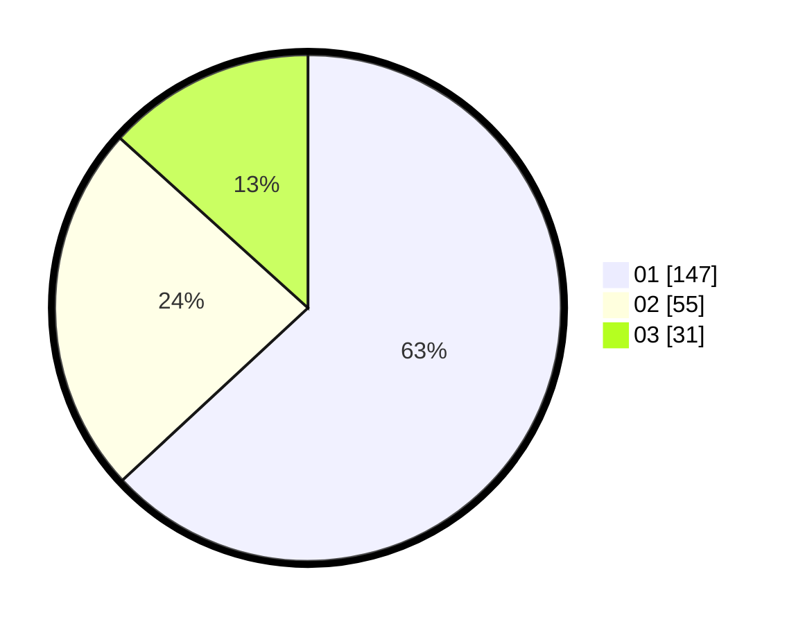

# Hasil

Hasil perolehan suara paslon dapat dilihat pada file paslon-01.txt, paslon-02.txt, dan paslon-03.txt.

Jika tidak ada, artinya data tersebut belum ada pada SIREKAP.

## Perolehan Suara

 * Paslon 01: **147**.
 * Paslon 02: **55**.
 * Paslon 03: **31**.

## Foto C Plano

https://sirekap-obj-formc.kpu.go.id/1843/pemilu/ppwp/31/74/04/10/06/3174041006092-20240214-155807--c85763ce-0eb1-4f0a-8810-e4f45ca88c81.jpg

https://sirekap-obj-formc.kpu.go.id/1843/pemilu/ppwp/31/74/04/10/06/3174041006092-20240214-155426--e9312bdb-2107-47ce-9b95-89ef77359ed3.jpg

https://sirekap-obj-formc.kpu.go.id/1843/pemilu/ppwp/31/74/04/10/06/3174041006092-20240215-135234--fec1a2b9-6702-4cad-9004-5342c322def2.jpg

## DATA PEMILIH TETAP

Jumlah pemilih dalam DPT: **272**.
 * L: **129**.
 * P: **143**.

## DATA PENGGUNA HAK PILIH

Jumlah pengguna hak pilih dalam DPT: **230**.
 * L: **104**.
 * P: **126**.

Jumlah pengguna hak pilih dalam DPTb: **4**.
 * L: **1**.
 * P: **3**.

Jumlah pengguna hak pilih dalam DPK: **0**.
 * L: **0**.
 * P: **0**.

Jumlah pengguna hak pilih: **234**.
 * L: **105**.
 * P: **129**.

## JUMLAH SUARA SAH DAN TIDAK SAH

JUMLAH SELURUH SUARA SAH: **233**.

JUMLAH SUARA TIDAK SAH: **1**.

JUMLAH SELURUH SUARA SAH DAN SUARA TIDAK SAH: **234**.
