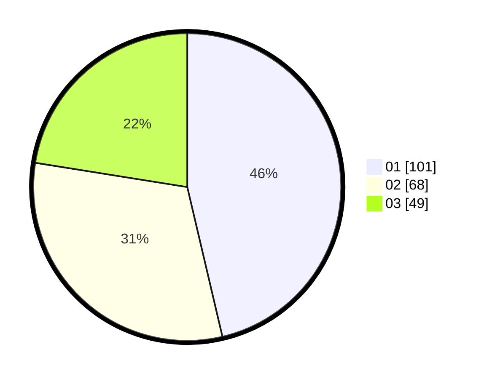

# Hasil

Hasil perolehan suara paslon dapat dilihat pada file paslon-01.txt, paslon-02.txt, dan paslon-03.txt.

Jika tidak ada, artinya data tersebut belum ada pada SIREKAP.

## Perolehan Suara

 * Paslon 01: **101**.
 * Paslon 02: **68**.
 * Paslon 03: **49**.

## Foto C Plano

https://sirekap-obj-formc.kpu.go.id/02db/pemilu/ppwp/31/74/04/10/06/3174041006094-20240214-232343--db794ef1-c184-4d96-a15c-28c2dd3bafcd.jpg

https://sirekap-obj-formc.kpu.go.id/02db/pemilu/ppwp/31/74/04/10/06/3174041006094-20240214-204142--bc79991e-3536-47f0-848b-060168423821.jpg

https://sirekap-obj-formc.kpu.go.id/02db/pemilu/ppwp/31/74/04/10/06/3174041006094-20240214-232902--a09af5d1-4ad5-467f-94fc-d7d91b174db7.jpg
