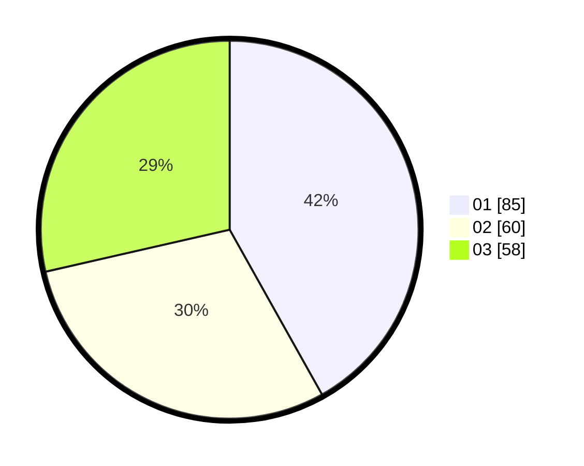

# Hasil

Hasil perolehan suara paslon dapat dilihat pada file paslon-01.txt, paslon-02.txt, dan paslon-03.txt.

Jika tidak ada, artinya data tersebut belum ada pada SIREKAP.

## Perolehan Suara

 * Paslon 01: **85**.
 * Paslon 02: **60**.
 * Paslon 03: **58**.

## Foto C Plano

https://sirekap-obj-formc.kpu.go.id/3d51/pemilu/ppwp/31/74/04/10/06/3174041006095-20240214-195559--a61388be-880e-408d-a25d-401710e4ff07.jpg

https://sirekap-obj-formc.kpu.go.id/3d51/pemilu/ppwp/31/74/04/10/06/3174041006095-20240214-195734--1fb619f1-19fb-45d8-98bf-cfebad032a6a.jpg

https://sirekap-obj-formc.kpu.go.id/3d51/pemilu/ppwp/31/74/04/10/06/3174041006095-20240214-195820--2c86010c-01ca-4be4-a0c9-4395992aa7b9.jpg

## DATA PEMILIH TETAP

Jumlah pemilih dalam DPT: **205**.
 * L: **83**.
 * P: **122**.

## DATA PENGGUNA HAK PILIH

Jumlah pengguna hak pilih dalam DPT: **198**.
 * L: **82**.
 * P: **116**.

Jumlah pengguna hak pilih dalam DPTb: **4**.
 * L: **1**.
 * P: **3**.

Jumlah pengguna hak pilih dalam DPK: **3**.
 * L: **0**.
 * P: **3**.

Jumlah pengguna hak pilih: **205**.
 * L: **83**.
 * P: **122**.

## JUMLAH SUARA SAH DAN TIDAK SAH

JUMLAH SELURUH SUARA SAH: **203**.

JUMLAH SUARA TIDAK SAH: **2**.

JUMLAH SELURUH SUARA SAH DAN SUARA TIDAK SAH: **205**.
