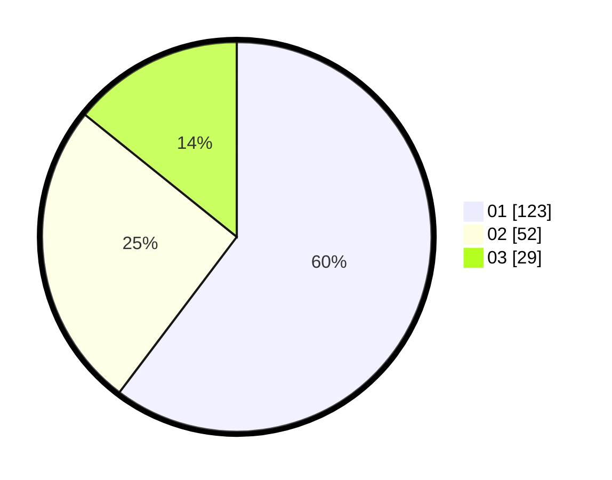

# Hasil

Hasil perolehan suara paslon dapat dilihat pada file paslon-01.txt, paslon-02.txt, dan paslon-03.txt.

Jika tidak ada, artinya data tersebut belum ada pada SIREKAP.

## Perolehan Suara

 * Paslon 01: **123**.
 * Paslon 02: **52**.
 * Paslon 03: **29**.

## Foto C Plano

https://sirekap-obj-formc.kpu.go.id/5c9e/pemilu/ppwp/31/74/04/10/06/3174041006099-20240214-185342--ccf391d6-8e1b-4da6-a2fe-fe9dfedcf5ca.jpg

https://sirekap-obj-formc.kpu.go.id/5c9e/pemilu/ppwp/31/74/04/10/06/3174041006099-20240214-155525--b117cbaa-2397-4248-949a-19506a3c55a5.jpg

https://sirekap-obj-formc.kpu.go.id/5c9e/pemilu/ppwp/31/74/04/10/06/3174041006099-20240214-155743--21c0015e-b389-4eae-aea7-3db0d37b8abd.jpg

## DATA PEMILIH TETAP

Jumlah pemilih dalam DPT: **227**.
 * L: **117**.
 * P: **110**.

## DATA PENGGUNA HAK PILIH

Jumlah pengguna hak pilih dalam DPT: **195**.
 * L: **99**.
 * P: **96**.

Jumlah pengguna hak pilih dalam DPTb: **9**.
 * L: **5**.
 * P: **4**.

Jumlah pengguna hak pilih dalam DPK: **2**.
 * L: **2**.
 * P: **0**.

Jumlah pengguna hak pilih: **206**.
 * L: **106**.
 * P: **100**.

## JUMLAH SUARA SAH DAN TIDAK SAH

JUMLAH SELURUH SUARA SAH: **204**.

JUMLAH SUARA TIDAK SAH: **2**.

JUMLAH SELURUH SUARA SAH DAN SUARA TIDAK SAH: **206**.
