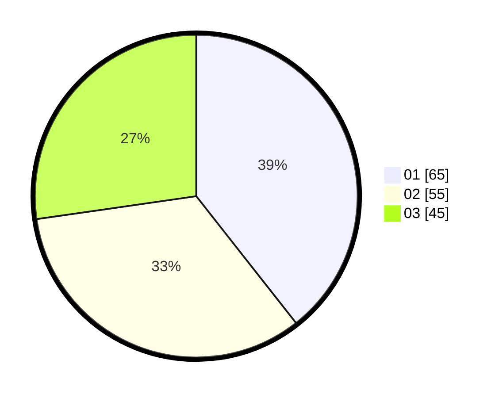

# Hasil

Hasil perolehan suara paslon dapat dilihat pada file paslon-01.txt, paslon-02.txt, dan paslon-03.txt.

Jika tidak ada, artinya data tersebut belum ada pada SIREKAP.

## Perolehan Suara

 * Paslon 01: **65**.
 * Paslon 02: **55**.
 * Paslon 03: **45**.

## Foto C Plano

https://sirekap-obj-formc.kpu.go.id/eb8c/pemilu/ppwp/31/74/04/10/06/3174041006106-20240214-192303--3364a9b5-01e9-43e7-91f8-1a16297359ac.jpg

https://sirekap-obj-formc.kpu.go.id/eb8c/pemilu/ppwp/31/74/04/10/06/3174041006106-20240214-192520--405e29a4-de15-4f17-8304-93bf0717de21.jpg

https://sirekap-obj-formc.kpu.go.id/eb8c/pemilu/ppwp/31/74/04/10/06/3174041006106-20240214-191924--89867471-83db-41c7-965f-64591445ce6a.jpg

## DATA PEMILIH TETAP

Jumlah pemilih dalam DPT: **213**.
 * L: **91**.
 * P: **122**.

## DATA PENGGUNA HAK PILIH

Jumlah pengguna hak pilih dalam DPT: **160**.
 * L: **69**.
 * P: **91**.

Jumlah pengguna hak pilih dalam DPTb: **3**.
 * L: **1**.
 * P: **2**.

Jumlah pengguna hak pilih dalam DPK: **4**.
 * L: **2**.
 * P: **2**.

Jumlah pengguna hak pilih: **167**.
 * L: **72**.
 * P: **95**.

## JUMLAH SUARA SAH DAN TIDAK SAH

JUMLAH SELURUH SUARA SAH: **165**.

JUMLAH SUARA TIDAK SAH: **2**.

JUMLAH SELURUH SUARA SAH DAN SUARA TIDAK SAH: **167**.
