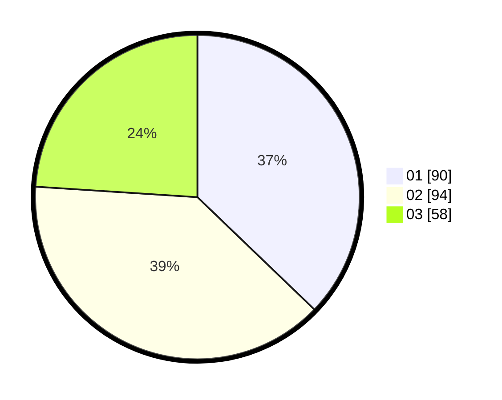

# Hasil

Hasil perolehan suara paslon dapat dilihat pada file paslon-01.txt, paslon-02.txt, dan paslon-03.txt.

Jika tidak ada, artinya data tersebut belum ada pada SIREKAP.

## Perolehan Suara

 * Paslon 01: **90**.
 * Paslon 02: **94**.
 * Paslon 03: **58**.

## Foto C Plano

https://sirekap-obj-formc.kpu.go.id/8994/pemilu/ppwp/31/74/04/10/06/3174041006110-20240214-213518--ea0c7d19-58de-4efa-be35-1793f3d66911.jpg

https://sirekap-obj-formc.kpu.go.id/8994/pemilu/ppwp/31/74/04/10/06/3174041006110-20240214-155345--869b3381-4cc4-40fe-8cf2-f7501df6460a.jpg

https://sirekap-obj-formc.kpu.go.id/8994/pemilu/ppwp/31/74/04/10/06/3174041006110-20240214-155451--ba6ad8e9-7287-4f26-89e8-ca5da6d6e042.jpg

## DATA PEMILIH TETAP

Jumlah pemilih dalam DPT: **286**.
 * L: **130**.
 * P: **156**.

## DATA PENGGUNA HAK PILIH

Jumlah pengguna hak pilih dalam DPT: **244**.
 * L: **109**.
 * P: **135**.

Jumlah pengguna hak pilih dalam DPTb: **0**.
 * L: **0**.
 * P: **0**.

Jumlah pengguna hak pilih dalam DPK: **2**.
 * L: **1**.
 * P: **1**.

Jumlah pengguna hak pilih: **246**.
 * L: **110**.
 * P: **136**.

## JUMLAH SUARA SAH DAN TIDAK SAH

JUMLAH SELURUH SUARA SAH: **242**.

JUMLAH SUARA TIDAK SAH: **4**.

JUMLAH SELURUH SUARA SAH DAN SUARA TIDAK SAH: **246**.
