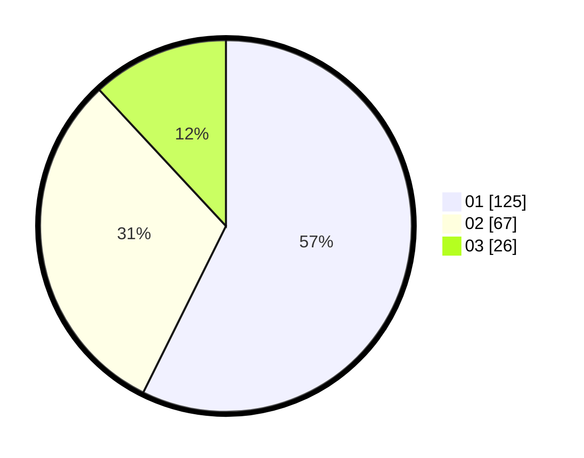

# Hasil

Hasil perolehan suara paslon dapat dilihat pada file paslon-01.txt, paslon-02.txt, dan paslon-03.txt.

Jika tidak ada, artinya data tersebut belum ada pada SIREKAP.

## Perolehan Suara

 * Paslon 01: **125**.
 * Paslon 02: **67**.
 * Paslon 03: **26**.

## Foto C Plano

https://sirekap-obj-formc.kpu.go.id/e397/pemilu/ppwp/31/74/04/10/06/3174041006111-20240214-201731--906ec591-5a7d-4624-b7f3-e92dcef563a2.jpg

https://sirekap-obj-formc.kpu.go.id/e397/pemilu/ppwp/31/74/04/10/06/3174041006111-20240214-201914--8e8cb7e9-acfd-43cc-8b47-264c4b6afc91.jpg

https://sirekap-obj-formc.kpu.go.id/e397/pemilu/ppwp/31/74/04/10/06/3174041006111-20240214-211327--786f7d5f-2285-447b-b078-c99b6b9b4782.jpg

## DATA PEMILIH TETAP

Jumlah pemilih dalam DPT: **281**.
 * L: **142**.
 * P: **139**.

## DATA PENGGUNA HAK PILIH

Jumlah pengguna hak pilih dalam DPT: **218**.
 * L: **112**.
 * P: **106**.

Jumlah pengguna hak pilih dalam DPTb: **2**.
 * L: **1**.
 * P: **1**.

Jumlah pengguna hak pilih dalam DPK: **2**.
 * L: **1**.
 * P: **1**.

Jumlah pengguna hak pilih: **222**.
 * L: **114**.
 * P: **108**.

## JUMLAH SUARA SAH DAN TIDAK SAH

JUMLAH SELURUH SUARA SAH: **218**.

JUMLAH SUARA TIDAK SAH: **4**.

JUMLAH SELURUH SUARA SAH DAN SUARA TIDAK SAH: **222**.
