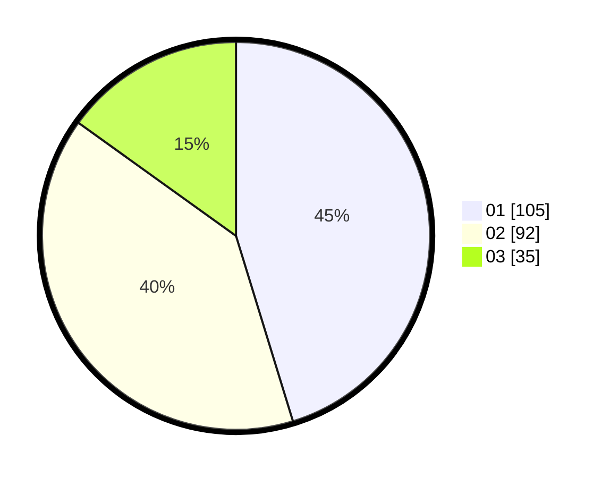

# Hasil

Hasil perolehan suara paslon dapat dilihat pada file paslon-01.txt, paslon-02.txt, dan paslon-03.txt.

Jika tidak ada, artinya data tersebut belum ada pada SIREKAP.

## Perolehan Suara

 * Paslon 01: **105**.
 * Paslon 02: **92**.
 * Paslon 03: **35**.

## Foto C Plano

https://sirekap-obj-formc.kpu.go.id/738a/pemilu/ppwp/31/74/04/10/06/3174041006112-20240214-224741--c542ba4b-7d7f-4c3c-b320-f1bb2a8c889d.jpg

https://sirekap-obj-formc.kpu.go.id/738a/pemilu/ppwp/31/74/04/10/06/3174041006112-20240214-224431--00e44c15-68b3-4ad3-94ab-ee5eaa6093af.jpg

https://sirekap-obj-formc.kpu.go.id/738a/pemilu/ppwp/31/74/04/10/06/3174041006112-20240214-224552--b851bed1-2ad5-4eda-80ee-69566f967d49.jpg

## DATA PEMILIH TETAP

Jumlah pemilih dalam DPT: **291**.
 * L: **140**.
 * P: **151**.

## DATA PENGGUNA HAK PILIH

Jumlah pengguna hak pilih dalam DPT: **235**.
 * L: **115**.
 * P: **120**.

Jumlah pengguna hak pilih dalam DPTb: **0**.
 * L: **0**.
 * P: **0**.

Jumlah pengguna hak pilih dalam DPK: **1**.
 * L: **0**.
 * P: **1**.

Jumlah pengguna hak pilih: **236**.
 * L: **115**.
 * P: **121**.

## JUMLAH SUARA SAH DAN TIDAK SAH

JUMLAH SELURUH SUARA SAH: **232**.

JUMLAH SUARA TIDAK SAH: **4**.

JUMLAH SELURUH SUARA SAH DAN SUARA TIDAK SAH: **236**.
